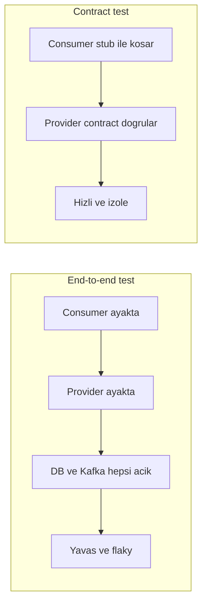
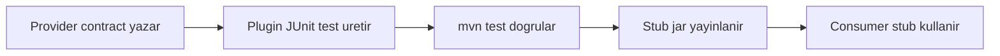
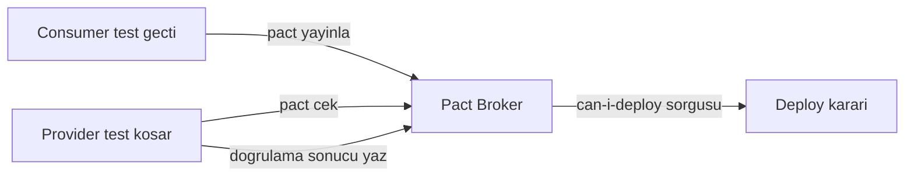

# Topic 12.5 — Contract Testing: Spring Cloud Contract, Pact

```admonish info title="Bu bölümde"
- Consumer-Driven Contracts (CDC) mantığı: provider değişimi consumer'ı neden kırar, contract test bunu production'dan önce nasıl yakalar
- Spring Cloud Contract (provider-driven, TR banking yaygın) vs Pact (consumer-driven, multi-language) — hangisi ne zaman
- Pact Broker + `can-i-deploy` deploy gate'i: consumer pact yayınlar, provider doğrular, CI kapıda durur
- Kafka event contract, Avro Schema Registry BACKWARD compatibility ve OpenAPI diff ile schema evolution kontrolü
- Banking'in strict matcher'ları: money decimal precision, ISO date, enum regex — ve kaçınılacak 10 anti-pattern
```

## Hedef

Microservice'ler arası **contract** garantisini kavramak: Consumer-Driven Contracts (CDC) ile provider değişimi consumer'ı kırmaz. Spring Cloud Contract (banking yaygın) ve Pact (multi-language broker) ile REST + Kafka contract yazabilmek, Pact Broker `can-i-deploy` gate'ini CI'a koyabilmek, Avro Schema Registry ile banking event schema evolution'ı ve breaking change detection'ı anlatabilmek.

## Süre

Okuma: 2 saat • Kendini Sına: 45 dk • Pratik (opsiyonel): 3-4 saat • Toplam: ~2.5 saat (+ pratik)

## Önbilgi

- Phase 6 (Messaging) bitti — Kafka producer/consumer, event akışı biliyorsun
- Phase 7 (Microservices) bitti — servisler ayrı deploy oluyor, aralarında HTTP/event var
- JUnit 5 (Topic 12.1) bitti — `@Test`, `@ExtendWith`, assertion rahat

---

## Kavramlar

### 1. Contract testing — neden?

Microservice'lerin can alıcı sorusu: provider (Account Service) response şeklini değiştirdi, consumer (Transfer Service) hâlâ eski şekli bekliyor — bunu ne zaman fark edeceksin?

**Problem:** Servisler ayrı deploy edilir. Provider `newBalance` alanını `balanceAfter` yaptı, consumer eski adı okuyor — kimse fark etmez, ta ki production'da transfer patlayana kadar.

Geleneksel çözümler yetersiz kalır:
- **End-to-end test:** İki servisi de ayağa kaldır, DB/Kafka bağla — yavaş, flaky, kurulumu ağır.
- **Integration test with real provider:** Provider'ın runtime'da çalışıyor olması gerekir; CI'da her provider'ı ayağa kaldırmak sürdürülemez.

**Contract testing** başka bir yol izler: <mark>consumer "ben bunu bekliyorum" diye bir contract beyan eder, provider CI'da bu contract'a hâlâ uyduğunu doğrular</mark>. Provider bozarsa CI kırmızıya döner — production'a hiç gitmeden yakalanır.

Aşağıdaki uyuşmazlık tam olarak contract test'in yakaladığı şeydir:

```
Consumer (Transfer Service) bekliyor:
  POST /accounts/{id}/debit
  → {accountId: UUID, balanceAfter: BigDecimal, status: 'OK'}

Provider (Account Service) döndürüyor:
  → {accountId: UUID, newBalance: BigDecimal, ok: true}
  → Mismatch → contract test fail
```

Contract test ile E2E'nin farkı hız ve izolasyondur: contract test tek servisi stub'a karşı koşar, E2E tüm dünyayı ayağa kaldırır.



**Tuzak:** Contract test E2E'yi tamamen yok etmez; "iki servis şeması uyumlu mu" sorusunu ucuza cevaplar ama uçtan uca iş akışını (login → transfer → bildirim) hâlâ birkaç smoke E2E ile doğrulamak istersin.

### 2. Spring Cloud Contract — provider-side

İlk framework **Spring Cloud Contract**: provider contract'ı yazar, plugin bu contract'tan hem provider testi hem consumer için stub üretir. Spring ekosisteminde ve TR banking'de en yaygın olanıdır.

```xml
<plugin>
    <groupId>org.springframework.cloud</groupId>
    <artifactId>spring-cloud-contract-maven-plugin</artifactId>
    <version>4.1.0</version>
    <extensions>true</extensions>
    <configuration>
        <baseClassForTests>com.bank.account.AccountContractBase</baseClassForTests>
        <testFramework>JUNIT5</testFramework>
        <testMode>MOCKMVC</testMode>
    </configuration>
</plugin>
```

Contract'ı Groovy DSL (veya YAML) ile yazarsın. Önce `request` kısmı — hangi çağrının geleceğini, hangi header ve body ile tanımlarsın:

```groovy
// src/test/resources/contracts/account/shouldDebitAccount.groovy
Contract.make {
    description "Should debit account successfully"
    request {
        method POST()
        url("/v1/accounts/acc-001/debit") {
            headers {
                contentType applicationJson()
                header("X-Idempotency-Key", anyAlphaNumeric())
                header("Authorization", anyAlphaNumeric())
            }
            body([ amount: 100.00, currency: "TRY", reference: $(anyUuid()) ])
        }
    }
}
```

`response` kısmında `$(producer(...), consumer(...))` sözdizimi kilit rol oynar: provider tarafı somut değeri (`950.00`) döndürür, consumer tarafı matcher'ı (`anyNumber()`) görür — böylece stub esnek, provider test'i somut olur:

```groovy
    response {
        status OK()
        headers { contentType applicationJson() }
        body([
            accountId: "acc-001",
            balanceAfter: $(producer(950.00), consumer(anyNumber())),
            status: "DEBITED",
            timestamp: $(producer(execute('localDateTime()')), consumer(anyDateTime()))
        ])
    }
```

<details>
<summary>Tam kod: shouldDebitAccount.groovy (~30 satır)</summary>

```groovy
// src/test/resources/contracts/account/shouldDebitAccount.groovy
Contract.make {
    description "Should debit account successfully"
    request {
        method POST()
        url("/v1/accounts/acc-001/debit") {
            headers {
                contentType applicationJson()
                header("X-Idempotency-Key", anyAlphaNumeric())
                header("Authorization", anyAlphaNumeric())
            }
            body([
                amount: 100.00,
                currency: "TRY",
                reference: $(anyUuid())
            ])
        }
    }
    response {
        status OK()
        headers {
            contentType applicationJson()
        }
        body([
            accountId: "acc-001",
            balanceAfter: $(producer(950.00), consumer(anyNumber())),
            status: "DEBITED",
            timestamp: $(producer(execute('localDateTime()')), consumer(anyDateTime()))
        ])
    }
}
```

</details>

Plugin, contract'tan JUnit testleri üretir; bu testlerin çalışması için bir **base class** yazarsın — controller'ı ayağa kaldırır, servisi mock'lar:

```java
public abstract class AccountContractBase {

    @Autowired
    protected AccountController accountController;

    @MockBean
    protected AccountService accountService;

    @BeforeEach
    void setup() {
        RestAssuredMockMvc.standaloneSetup(accountController);
        when(accountService.debit(eq("acc-001"), any())).thenReturn(
            new DebitResult("acc-001", new BigDecimal("950.00"), "DEBITED", Instant.now()));
    }
}
```

`mvn test` çalıştığında plugin'in ürettiği testler controller'ın contract'a uyduğunu doğrular. Akışı özetle: provider yazar, plugin üretir, stub yayınlanır, consumer tüketir.



### 3. Consumer side — stub usage

Provider stub'ı ürettikten sonra soru şu: consumer bunu gerçek provider'ı ayağa kaldırmadan nasıl kullanır? Cevap **stub** jar'ı: Maven repo'ya veya git'e yayınlanır, consumer test bağımlılığı olarak çeker.

```xml
<dependency>
    <groupId>com.bank</groupId>
    <artifactId>account-service</artifactId>
    <version>1.0.0</version>
    <classifier>stubs</classifier>
    <type>jar</type>
    <scope>test</scope>
</dependency>
```

`@AutoConfigureStubRunner` stub'ı belirtilen portta ayağa kaldırır; consumer test gerçek provider yerine bu stub'a konuşur:

```java
@SpringBootTest
@AutoConfigureStubRunner(
    ids = "com.bank:account-service:+:stubs:8090",
    stubsMode = StubRunnerProperties.StubsMode.LOCAL
)
class TransferServiceTest {

    @Autowired AccountClient accountClient;

    @Test
    void shouldUseAccountServiceForDebit() {
        DebitResult result = accountClient.debit("acc-001", new BigDecimal("100"));

        assertThat(result.balanceAfter()).isNotNull();   // stub'tan gelir
        assertThat(result.status()).isEqualTo("DEBITED");
    }
}
```

Kritik nokta: consumer test provider'ın **yayınlanmış stub'ına** karşı koşar — gerçek Account Service çalışmaz. Provider stub'ı güncellerse consumer bir sonraki build'de yeni stub'ı çeker ve uyuşmazlık anında görünür.

### 4. Pact — multi-language broker model

İkinci framework **Pact**: consumer-driven ve çok dilli (Java, JS, Go, Ruby). Provider'ın da consumer'ın da farklı dillerde olduğu polyglot banking ortamında öne çıkar. Spring Cloud Contract provider'dan başlarken, Pact consumer'dan başlar.

```xml
<dependency>
    <groupId>au.com.dius.pact.consumer</groupId>
    <artifactId>junit5</artifactId>
    <version>4.6.5</version>
    <scope>test</scope>
</dependency>
<dependency>
    <groupId>au.com.dius.pact.provider</groupId>
    <artifactId>junit5spring</artifactId>
    <version>4.6.5</version>
    <scope>test</scope>
</dependency>
```

Consumer tarafında `@Pact` bir interaction tanımlar: verilen state altında (`given`) hangi request'e (`uponReceiving`) ne cevap beklendiğini `PactDslJsonBody` ile modeller:

```java
    @Pact(consumer = "transfer-service")
    public RequestResponsePact debitAccount(PactDslWithProvider builder) {
        return builder
            .given("account acc-001 has balance 1000.00")
            .uponReceiving("a debit request for 100 TRY")
                .path("/v1/accounts/acc-001/debit")
                .method("POST")
                .body(new PactDslJsonBody()
                    .decimalType("amount", 100.00)
                    .stringValue("currency", "TRY")
                    .uuid("reference"))
            .willRespondWith()
                .status(200)
                .body(new PactDslJsonBody()
                    .stringValue("accountId", "acc-001")
                    .decimalType("balanceAfter", 900.00)
                    .stringValue("status", "DEBITED"))
            .toPact();
    }
```

`@Test` ise Pact'in ayağa kaldırdığı `MockServer`'a gerçek client'ı konuşturur; test geçerse Pact JSON üretilir:

```java
    @Test
    @PactTestFor(providerName = "account-service", pactMethod = "debitAccount")
    void verifyDebitWorks(MockServer mockServer) {
        AccountClient client = new AccountClient(mockServer.getUrl());
        DebitResult result = client.debit("acc-001", new BigDecimal("100"), "TRY");

        assertThat(result.balanceAfter()).isEqualByComparingTo("900.00");
    }
```

<details>
<summary>Tam kod: TransferAccountContractTest (~36 satır)</summary>

```java
@ExtendWith(PactConsumerTestExt.class)
class TransferAccountContractTest {

    @Pact(consumer = "transfer-service")
    public RequestResponsePact debitAccount(PactDslWithProvider builder) {
        return builder
            .given("account acc-001 has balance 1000.00")
            .uponReceiving("a debit request for 100 TRY")
                .path("/v1/accounts/acc-001/debit")
                .method("POST")
                .matchHeader("Content-Type", "application/json")
                .body(new PactDslJsonBody()
                    .decimalType("amount", 100.00)
                    .stringValue("currency", "TRY")
                    .uuid("reference"))
            .willRespondWith()
                .status(200)
                .matchHeader("Content-Type", "application/json")
                .body(new PactDslJsonBody()
                    .stringValue("accountId", "acc-001")
                    .decimalType("balanceAfter", 900.00)
                    .stringValue("status", "DEBITED"))
            .toPact();
    }

    @Test
    @PactTestFor(providerName = "account-service", pactMethod = "debitAccount")
    void verifyDebitWorks(MockServer mockServer) {
        AccountClient client = new AccountClient(mockServer.getUrl());

        DebitResult result = client.debit("acc-001", new BigDecimal("100"), "TRY");

        assertThat(result.balanceAfter()).isEqualByComparingTo("900.00");
    }
}
```

</details>

Üretilen Pact JSON **Pact Broker'a** yayınlanır. Ama burada iş bitmez: contract'ın bir anlam taşıması için **provider verification** şarttır — provider, consumer'ın yayınladığı her pact'ı kendi tarafında doğrulamalıdır.

Provider verification testinde önce broker'a bağlanır ve target'ı ayarlarsın:

```java
@SpringBootTest(webEnvironment = WebEnvironment.RANDOM_PORT)
@Provider("account-service")
@PactBroker(host = "pact-broker.bank.com", port = "443", scheme = "https",
            authentication = @PactBrokerAuth(token = "${PACT_BROKER_TOKEN}"))
class AccountProviderVerificationTest {

    @LocalServerPort int port;
    @MockBean AccountService accountService;

    @BeforeEach
    void setup(PactVerificationContext context) {
        context.setTarget(new HttpTestTarget("localhost", port));
    }
```

Sonra her `given(...)` state'i için bir `@State` method'u state'i kurar; `@TestTemplate` broker'daki tüm pact'ları tek tek doğrular:

```java
    @State("account acc-001 has balance 1000.00")
    void setupAccountState() {
        when(accountService.debit("acc-001", any())).thenReturn(
            new DebitResult("acc-001", new BigDecimal("900.00"), "DEBITED", Instant.now()));
    }

    @TestTemplate
    @ExtendWith(PactVerificationInvocationContextProvider.class)
    void pactVerificationTest(PactVerificationContext context) {
        context.verifyInteraction();
    }
}
```

<details>
<summary>Tam kod: AccountProviderVerificationTest (~28 satır)</summary>

```java
@SpringBootTest(webEnvironment = WebEnvironment.RANDOM_PORT)
@Provider("account-service")
@PactBroker(host = "pact-broker.bank.com", port = "443", scheme = "https",
            authentication = @PactBrokerAuth(token = "${PACT_BROKER_TOKEN}"))
class AccountProviderVerificationTest {

    @LocalServerPort int port;

    @MockBean AccountService accountService;

    @BeforeEach
    void setup(PactVerificationContext context) {
        context.setTarget(new HttpTestTarget("localhost", port));
    }

    @State("account acc-001 has balance 1000.00")
    void setupAccountState() {
        when(accountService.debit("acc-001", any())).thenReturn(
            new DebitResult("acc-001", new BigDecimal("900.00"), "DEBITED", Instant.now()));
    }

    @TestTemplate
    @ExtendWith(PactVerificationInvocationContextProvider.class)
    void pactVerificationTest(PactVerificationContext context) {
        context.verifyInteraction();
    }
}
```

</details>

```admonish warning title="Provider verification olmadan contract yalan söyler"
Sadece consumer pact yayınlamak yeterli değildir. Provider bu pact'ı kendi CI'ında doğrulamazsa, consumer'ın hayali beklentisi hiç sınanmamış olur — provider değişince kimse fark etmez. Contract testing'in tüm değeri provider verification'ın CI'da koşmasındadır.
```

### 5. Pact Broker — central registry

Pact JSON dosyalarını e-posta ile paslaşamazsın; ortak bir kayıt defterine ihtiyaç var: **Pact Broker**. Broker üç şeyi saklar ve ilişkilendirir:
- Pact contract'ları (consumer yayınlar)
- Verification sonuçları (provider yayınlar)
- `can-i-deploy` sorgularının cevabı

Akış çift yönlüdür: consumer testi geçince pact'ı push eder, provider testi broker'dan pact'ı çekip doğrular ve sonucu geri yazar. Deploy kararı bu iki bilginin kesişiminden çıkar.



`can-i-deploy` deploy güvenliğinin kalbidir: bir versiyonu deploy etmeden önce, o versiyonun bağımlı olduğu tüm contract'ların ilgili ortamda doğrulanmış olup olmadığını sorar.

```bash
pact-broker can-i-deploy \
  --pacticipant transfer-service \
  --version 1.5

# Yes → v1.5 için tüm provider verification'lar geçmiş
# No  → en az biri eksik/başarısız, deploy etme
```

Banking'de bunu CI'a bir **gate** olarak koyarsın: <mark>can-i-deploy geçmeden hiçbir servis production'a çıkamaz</mark> — böylece "consumer'ın contract'ı doğrulanmadan deploy edildi, production'da patladı" senaryosu kapı önünde durdurulur.

```bash
pact-broker can-i-deploy \
  --pacticipant transfer-service \
  --version $GIT_SHA \
  --to-environment production
```

```admonish warning title="Broker banking'de private olmalı"
Pact'lar aslında API tasarımının kendisidir — endpoint'ler, alanlar, akışlar. Bu güvenlik açısından hassas bilgidir. Public bir broker (veya SaaS Pactflow'da yanlış izinler) banking API yüzeyini sızdırır. Broker'ı private tut, token ile koru.
```

### 6. Banking — contract for events (Kafka)

Contract sadece REST için değil: bir servis Kafka'ya event basıyor, başka servis tüketiyorsa event şeması da bir contract'tır. Spring Cloud Contract mesaj stub'ı bunu kapsar — `label` ile tetiklenen bir `outputMessage` tanımlarsın:

```groovy
Contract.make {
    description "Transfer initiated event"
    label "transferInitiated"
    input {
        triggeredBy "publishTransferInitiated()"
    }
    outputMessage {
        sentTo "transfer-events"
        body([
            transferId: $(anyUuid()),
            fromAccount: "acc-001",
            toAccount: "acc-002",
            amount: 100.00,
            currency: "TRY",
            timestamp: $(producer(execute('localDateTime()')), consumer(anyDateTime()))
        ])
        headers {
            header("traceparent", anything())
        }
    }
}
```

Consumer tarafı stub'ı `label` ile tetikler; stub, contract'taki event'i basar ve consumer'ın onu doğru işlediğini doğrularsın:

```java
@AutoConfigureStubRunner(ids = "com.bank:transfer-service:+:stubs", repositoryRoot = "...")
class FraudServiceContractTest {

    @Test
    void shouldConsumeTransferInitiatedEvent() {
        stubFinder.trigger("transferInitiated");   // stub event basar

        await().untilAsserted(() ->
            assertThat(fraudService.processedCount()).isEqualTo(1));
    }
}
```

Böylece producer event şemasını değiştirdiğinde (alan adı, tip) breaking change contract test'te yakalanır — production'da "fraud servisi event'i parse edemedi" krizi yaşanmaz.

### 7. Schema registry — Avro contract

Kafka event'lerinde şema garantisini bir adım öteye taşıyan yapı **Schema Registry** (Confluent veya Apicurio): producer şemayı registry'ye yazar, consumer okurken registry uyumluluğu doğrular. **Avro** ile birlikte banking'de güçlü bir contract oluşturur.

En kritik kavram **compatibility mode** — yeni şema eski veriyle/consumer'la nasıl geçinir:

```
BACKWARD (default): Yeni şema eski veriyi okuyabilir
FORWARD:            Eski şema yeni veriyi okuyabilir
FULL:               Her iki yön de
NONE:               Kontrol yok
```

Banking pratiğinde **BACKWARD compatibility** tercih edilir: producer şemayı güncellese bile eski consumer'lar okumaya devam edebilir. Bunun somut kuralı yeni alanı `optional` + `default` ile eklemektir:

```json
// v1
{
  "type": "record",
  "name": "TransferEvent",
  "fields": [
    {"name": "transferId", "type": "string"},
    {"name": "amount", "type": "string"}
  ]
}
```

Yeni `currency` alanını `["null", "string"]` union'ı ve `default: null` ile eklersin — eski consumer alanı görmezden gelir, yeni consumer okur:

```json
// v2 — optional alan eklendi, BACKWARD compatible
{
  "type": "record",
  "name": "TransferEvent",
  "fields": [
    {"name": "transferId", "type": "string"},
    {"name": "amount", "type": "string"},
    {"name": "currency", "type": ["null", "string"], "default": null}
  ]
}
```

```admonish tip title="Zorunlu alan eklemek breaking'dir"
`default`'suz zorunlu bir alan eklersen BACKWARD compat bozulur: default'u olmayan yeni alanı eski veri sağlayamaz, eski consumer da yeni veriyi okuyamaz. Kural: yeni alan her zaman optional + default. Registry compat modu BACKWARD'ken bu ihlali reddeder ve deploy'u durdurur.
```

### 8. OpenAPI contract test

Pact/Spring Cloud Contract fazla ağır geldiğinde, REST için hafif bir contract yolu daha var: **OpenAPI** spec'ini contract olarak kullanmak. Provider spec üretir, consumer ona uyduğunu doğrular.

```xml
<dependency>
    <groupId>org.openapitools</groupId>
    <artifactId>openapi-generator-maven-plugin</artifactId>
</dependency>
```

Consumer client'ını doğrudan spec'ten üretebilirsin — böylece client her zaman spec'e sadık kalır:

```bash
openapi-generator-cli generate -i account-service-openapi.json -g java -o ./generated-client
```

Asıl güç breaking change detection'da: iki spec sürümünü diff'leyip uyumsuzlukta CI'ı düşürürsün:

```bash
openapi-diff old-spec.json new-spec.json --fail-on-incompatible
```

Bu tam CDC değildir (consumer beklentisini modellemez, sadece şema uyumunu bakar) ama banking REST API'leri için ucuz bir **lightweight contract test** olarak işe yarar.

### 9. Banking contract patterns

Banking contract'larının farkı gevşek değil **strict** olmalarıdır: para, tarih ve durum alanları belirsizlik kaldırmaz. Dört yaygın kalıp:

**Pattern 1 — Money precision:** her tutar 2 ondalık:

```groovy
body([
    amount: $(producer(100.00), consumer(matching("\\d+\\.\\d{2}")))
])
```

**Pattern 2 — ISO date format:** timestamp ISO-8601:

```groovy
body([
    timestamp: $(producer(execute('iso8601')), consumer(matching("\\d{4}-\\d{2}-\\d{2}T.*Z")))
])
```

**Pattern 3 — Optional vs mandatory:** zorunlu alan matcher ile, opsiyonel alan `optional(...)` ile:

```groovy
// Mandatory
body([ transferId: $(anyUuid()), amount: $(any()) ])

// Optional with default
body([ transferId: $(anyUuid()), description: $(optional("Transfer")) ])
```

**Pattern 4 — Status enum:** durum yalnızca izinli değerlerden:

```groovy
body([
    status: $(producer("COMPLETED"), consumer(regex("INITIATED|COMPLETED|FAILED|REVERSED")))
])
```

### 10. Banking — contract testing anti-pattern'leri

Mülakatta "bu contract setup'ında ne yanlış?" cephaneliği burası. On klasik hata:

**Anti-pattern 1 — No contract / E2E only:** yavaş feedback; microservice'de CDC şart.

**Anti-pattern 2 — Contract test aynı modülde:** provider değeri kaybolur. Stub publish + consumer pull kalıbı olmalı.

**Anti-pattern 3 — Loose matcher her yerde:**

```groovy
body([ amount: $(any()) ])   // her şey eşleşir, garanti yok
```

Banking'de **strict type** kullan — format regex'i, decimal precision.

**Anti-pattern 4 — Schema migration'ı verify etmeden:** Avro BACKWARD bozulur → consumer çöker. CI gate koy.

**Anti-pattern 5 — Provider state leak:** `@State` setup'ı paylaşılan state'i değiştirir. Her test izole olmalı.

**Anti-pattern 6 — Public Pact broker:** banking pact = API tasarımı (güvenlik hassas). Private broker.

**Anti-pattern 7 — Şişmiş contract:** 50 alanlık contract. Sadece core alanları test et.

**Anti-pattern 8 — can-i-deploy gate yok:** CI yeşil ama consumer contract'ı doğrulanmamış → production fail. Gate zorunlu.

**Anti-pattern 9 — Mock provider stub yerine:** mock = bağımsız test verisi, stub = yayınlanmış contract. Banking'de stub kullan.

**Anti-pattern 10 — Stub version drift:** consumer eski stub, provider yeni. Version pinning + CI verify.

---

## Önemli olabilecek araştırma kaynakları

- Spring Cloud Contract docs
- Pact docs + Pact Broker / Pactflow
- Confluent Schema Registry, Apicurio Registry
- "Building Microservices" — Sam Newman (contract testing bölümü)

---

## Kendini Sına

Aşağıdaki soruları önce **cevaba bakmadan** kendi cümlelerinle yanıtlamayı dene — hepsi TR bank mülakatlarında karşına çıkabilecek tarzda. Takıldığın soru olursa ilgili Kavramlar başlığına dön, sonra tekrar dene.

**S1. Consumer-Driven Contract nedir ve geleneksel end-to-end testten ne farkı vardır?**

<details>
<summary>Cevabı göster</summary>

CDC'de consumer "provider'dan şu şekli bekliyorum" diye bir contract beyan eder; provider CI'da bu contract'a hâlâ uyduğunu doğrular. Böylece provider bir alanı yeniden adlandırdığında veya tipini değiştirdiğinde CI kırmızıya döner ve breaking change production'a hiç ulaşmadan yakalanır.

E2E testi ise iki (veya daha fazla) servisi, DB'yi ve Kafka'yı ayağa kaldırıp uçtan uca akışı koşar — yavaş, flaky ve kurulumu ağırdır. Contract test tek servisi stub/mock'a karşı koştuğu için hızlı ve izoledir. İkisi rakip değildir: contract test "şemalar uyumlu mu" sorusunu ucuza cevaplar, birkaç smoke E2E ise uçtan uca iş akışını doğrular.

</details>

**S2. Spring Cloud Contract ile Pact arasındaki temel fark nedir? Banking'de hangisini seçersin?**

<details>
<summary>Cevabı göster</summary>

Spring Cloud Contract provider-driven'dır: provider contract'ı yazar, plugin hem provider testini hem consumer için stub'ı üretir; Spring ekosisteminde ve tek dilli (JVM) ortamlarda çok rahattır. Pact ise consumer-driven ve multi-language'dır (Java, JS, Go, Ruby) — consumer pact'ı üretir, Pact Broker üzerinden provider doğrular.

Banking'de seçim ekosisteme bağlıdır: her şey Spring/JVM ise Spring Cloud Contract daha az sürtünmeyle çalışır ve TR banking'de yaygındır. Consumer'lar ve provider'lar farklı dillerdeyse (polyglot) veya merkezi bir broker + can-i-deploy gate'i istiyorsan Pact öne çıkar. İkisi de aynı CDC fikrini uygular; fark araç ve iş akışıdır.

</details>

**S3. Stub publish + consumer `@AutoConfigureStubRunner` workflow'u nasıl işler?**

<details>
<summary>Cevabı göster</summary>

Provider, contract'larından bir stub jar üretir ve `stubs` classifier'ı ile Maven repo'ya (veya git'e) yayınlar. Consumer bu stub'ı `<classifier>stubs</classifier>` bağımlılığı olarak test scope'unda çeker. Test sınıfında `@AutoConfigureStubRunner(ids = "...:stubs:8090")` stub'ı belirtilen portta ayağa kaldırır ve consumer gerçek provider yerine bu stub'a konuşur.

Değeri şu: consumer testi provider'ın yayınlanmış contract'ına karşı koşar, gerçek servisi ayağa kaldırmaya gerek kalmaz. Provider contract'ı değiştirip yeni stub yayınlarsa, consumer bir sonraki build'de yeni stub'ı çeker ve uyuşmazlık anında test'te görünür. Version pinning ve CI verify ile stub drift'i önlenir.

</details>

**S4. Pact Broker neden gereklidir ve `can-i-deploy` ne işe yarar?**

<details>
<summary>Cevabı göster</summary>

Broker, pact'ları e-posta/dosya ile paslaşmak yerine merkezi bir kayıt defterinde tutar: consumer'ların yayınladığı contract'ları, provider'ların yazdığı verification sonuçlarını ve bunlar arasındaki ilişkiyi saklar. Böylece "hangi consumer hangi provider'ın hangi versiyonuna bağımlı ve doğrulandı mı" sorusu tek yerden cevaplanır.

`can-i-deploy` bu bilgiyi bir deploy gate'ine çevirir: bir versiyonu (ör. `$GIT_SHA`) belirli bir ortama deploy etmeden önce, o versiyonun bağımlı olduğu tüm contract'ların o ortamda doğrulanmış olup olmadığını sorar. Hepsi geçtiyse "Yes", biri eksik/başarısızsa "No" döner. CI'a gate olarak konunca, doğrulanmamış bir contract'la production'a çıkmak imkânsız hale gelir.

</details>

**S5. Sadece consumer pact yayınlamak yeterli mi? Provider verification neden şarttır?**

<details>
<summary>Cevabı göster</summary>

Hayır, yeterli değil. Consumer pact yalnızca consumer'ın *beklentisini* ifade eder — "ben provider'dan şunu bekliyorum". Bu beklenti provider tarafında sınanmadıkça bir hayaldir; provider gerçekten o response'u döndürüyor mu bilinmez.

Provider verification testi broker'dan tüm consumer pact'larını çeker, her `given(...)` state'ini `@State` method'uyla kurar ve gerçek provider endpoint'ine karşı `verifyInteraction()` ile doğrular. Ancak bu koştuğunda contract iki taraflı bir garanti olur. Provider verification olmadan CDC'nin bütün değeri kaybolur; bu yüzden anti-pattern listesinde "verification'sız contract" ve "can-i-deploy gate yok" ayrı ayrı sayılır.

</details>

**S6. Banking'de neden `$(any())` gibi loose matcher yerine strict matcher kullanılır? Üç örnek ver.**

<details>
<summary>Cevabı göster</summary>

`$(any())` her değeri kabul eder — yani provider tutarı `"100"`, `"100.0"` veya `"yüz"` döndürse bile contract geçer. Banking'de bu tehlikelidir: para, tarih ve durum alanlarında format garantisi olmadan consumer sessizce yanlış veriyi işleyebilir. Strict matcher, contract'ı gerçek bir şema garantisine çevirir.

Üç örnek: money precision için `matching("\\d+\\.\\d{2}")` — her tutar tam 2 ondalık; ISO date için `matching("\\d{4}-\\d{2}-\\d{2}T.*Z")` — timestamp ISO-8601; status için `regex("INITIATED|COMPLETED|FAILED|REVERSED")` — durum yalnızca izinli enum değerlerinden. UUID alanları için de `anyUuid()` gibi tipli matcher kullanılır. Kural: consumer tarafında beklentiyi mümkün olduğunca dar tanımla.

</details>

**S7. Kafka event'lerinde Avro Schema Registry BACKWARD compatibility banking event evolution'ı nasıl korur?**

<details>
<summary>Cevabı göster</summary>

BACKWARD compatibility "yeni şema eski veriyi okuyabilmeli" kuralını uygular ve Schema Registry'de banking için tercih edilen moddur. Pratik karşılığı: producer şemayı güncellese bile eski consumer'lar kırılmadan okumaya devam eder — bu, servisleri ayrı ayrı ve farklı hızlarda deploy edebilmenin ön koşuludur.

Somut kural: yeni alan her zaman optional + default olarak eklenir, ör. `{"name": "currency", "type": ["null", "string"], "default": null}`. Böylece eski veride alan yoksa default devreye girer, eski consumer alanı görmezden gelir. `default`'suz zorunlu bir alan eklemek BACKWARD compat'ı bozar; registry compat modu BACKWARD'ken bu ihlali reddeder ve deploy'u kapıda durdurur. Aynı disiplini Spring Cloud Contract mesaj stub'ı ile event contract test'i tamamlar.

</details>

---

## Tamamlama kriterleri

- [ ] "Kendini Sına" bölümündeki tüm soruları cevaba bakmadan açıklayabiliyorum
- [ ] Contract testing ile E2E'nin farkını ve neden ikisinin de gerektiğini anlatabiliyorum
- [ ] Spring Cloud Contract (provider-driven) vs Pact (consumer-driven) seçimini gerekçelendirebiliyorum
- [ ] Stub publish + consumer `@AutoConfigureStubRunner` workflow'unu çizebiliyorum
- [ ] Provider verification'ın neden şart olduğunu ve `@State` + `verifyInteraction()` mekanizmasını açıklayabiliyorum
- [ ] Pact Broker + `can-i-deploy` gate'ini bir CI deploy güvenliği olarak anlatabiliyorum
- [ ] Kafka event contract, Avro BACKWARD compatibility ve OpenAPI diff ile schema evolution kontrolünü biliyorum
- [ ] Banking strict matcher'larını (money precision, ISO date, enum regex) ve en az 5 anti-pattern'i sayabiliyorum

---

## Defter notları

1. "Contract test vs E2E trade-off ve neden ikisi birden gerekir: ____."
2. "Spring Cloud Contract provider-driven vs Pact consumer-driven, banking seçim kriteri: ____."
3. "Stub publish (Maven `stubs` classifier) + consumer `@AutoConfigureStubRunner` workflow: ____."
4. "Provider verification neden şart, consumer pact tek başına neden yalan söyler: ____."
5. "Pact Broker `can-i-deploy` CI gate banking deploy safety'yi nasıl sağlar: ____."
6. "Kafka event contract + Spring Cloud Contract message stub (`label` + `outputMessage`): ____."
7. "Avro Schema Registry BACKWARD compat, yeni alan optional + default kuralı: ____."
8. "Banking strict matcher (money `\\d+\\.\\d{2}`, ISO date, enum regex) neden loose yerine: ____."
9. "OpenAPI diff `--fail-on-incompatible` REST breaking change detection: ____."
10. "Provider `@State` izolasyonu ve private broker — iki anti-pattern'in gerekçesi: ____."

```admonish success title="Bölüm Özeti"
- Contract testing consumer'ın beklentisini bir contract'a çevirir; provider CI'da bu contract'a uyduğunu doğrular — breaking change production'a gitmeden yakalanır, E2E'nin yavaşlığı olmadan
- Spring Cloud Contract provider-driven (Spring/JVM, TR banking yaygın), Pact consumer-driven + multi-language + broker; ikisi de aynı CDC fikrini uygular, fark araç ve workflow
- Stub publish + consumer pull kalıbı şarttır: consumer gerçek provider'ı ayağa kaldırmadan yayınlanmış stub'a karşı koşar
- Provider verification olmadan contract yalan söyler; Pact Broker + `can-i-deploy` gate'i doğrulanmamış bir contract'la deploy'u kapıda durdurur
- Event tarafında Kafka contract + Avro Schema Registry BACKWARD compat (yeni alan optional + default) ve OpenAPI diff schema evolution'ı güvenli tutar
- Banking'de matcher'lar strict olmalı (money precision, ISO date, enum regex); loose matcher, public broker, verify'sız migration ve can-i-deploy gate eksikliği başlıca anti-pattern'ler
```

---

## Pratik yapmak istersen

Kavramları koda dökmek istersen aşağıdaki iki ek hazır: test yazma rehberi banking strict matcher'lı bir consumer Pact contract'ı ile başlar; Claude-verify prompt'u ile yazdığın contract testing setup'ını banking-grade perspektiften denetletebilirsin.

<details>
<summary>Test yazma rehberi</summary>

Aşağıdaki test, strict banking matcher'ları (decimal precision, enum regex) ile bir consumer Pact contract'ı kurar ve gerçek client'ı Pact'in `MockServer`'ına konuşturur. `decimalMatcher` ve `stringMatcher` sayesinde contract sadece "response geldi" değil, "doğru formatta geldi" garantisini verir.

```java
// Consumer test with Pact
@ExtendWith(PactConsumerTestExt.class)
class TransferAccountIntegrationTest {

    @Pact(consumer = "transfer-service", provider = "account-service")
    public RequestResponsePact debitContract(PactDslWithProvider builder) {
        return builder
            .given("account acc-001 exists with balance 1000")
            .uponReceiving("a debit of 100 TRY")
                .path("/v1/accounts/acc-001/debit")
                .method("POST")
                .body(new PactDslJsonBody()
                    .decimalMatcher("amount", "\\d+\\.\\d{2}", 100.00)
                    .stringValue("currency", "TRY")
                    .uuid("reference"))
            .willRespondWith()
                .status(200)
                .body(new PactDslJsonBody()
                    .stringValue("accountId", "acc-001")
                    .decimalMatcher("balanceAfter", "\\d+\\.\\d{2}", 900.00)
                    .stringMatcher("status", "DEBITED|FAILED", "DEBITED"))
            .toPact();
    }

    @Test
    @PactTestFor(pactMethod = "debitContract")
    void shouldDebitViaAccountService(MockServer mockServer) {
        AccountClient client = new AccountClient(mockServer.getUrl());

        DebitResult result = client.debit("acc-001", new BigDecimal("100"), "TRY");

        assertThat(result.balanceAfter()).isEqualByComparingTo("900.00");
        assertThat(result.status()).isEqualTo("DEBITED");
    }
}
```

> Genişletme fikirleri: (1) provider tarafında `@Provider` + `@State` ile bu pact'ı doğrulayan bir verification testi ekle; (2) Kafka event contract'ı için `stubFinder.trigger("transferInitiated")` ile consumer'ın event'i işlediğini `await()` ile doğrula; (3) Avro v1→v2 (optional + default alan) evolution'ı BACKWARD compat modunda test et ve zorunlu alan eklemenin reddedildiğini gözlemle.

Tamamlama kriteri: en az bir consumer contract + karşılığında bir provider verification koşuyor, strict matcher (decimal precision + enum regex) kullanılmış ve testler yeşil.

</details>

<details>
<summary>Claude-verify prompt</summary>

Aşağıdaki prompt'u yazdığın contract testing setup'ıyla birlikte Claude'a ver; her maddeyi PASS / FAIL / EKSIK olarak işaretlemesini iste.

```
Contract testing setup'ımı banking-grade kriterlere göre değerlendir:

1. Framework:
   - Spring Cloud Contract veya Pact?
   - Banking polyglot need varsa Pact?
   - Pact Broker / Spring Cloud Contract stubs?

2. Coverage:
   - REST endpoint contracts?
   - Kafka event contracts?
   - Avro Schema Registry?
   - OpenAPI diff?

3. Banking patterns:
   - Money decimal precision matcher?
   - ISO date format?
   - Status enum regex?
   - UUID format?

4. CI integration:
   - Contract tests in CI?
   - can-i-deploy gate?
   - Schema compatibility check?

5. Multi-environment:
   - Pact broker tags (environment)?
   - Verify against current production version?
   - Block deploy if not verified?

6. State management:
   - Provider @State independent?
   - No shared mutable state?

7. Stub distribution:
   - Maven classifier stubs?
   - Pact broker?
   - Version pinning?

8. Anti-pattern:
   - End-to-end only YOK?
   - Loose matchers YOK?
   - Schema migration uncontrolled YOK?
   - Provider state leak YOK?
   - Bloated contracts YOK?
   - No can-i-deploy gate YOK?

9. Banking event evolution:
   - Avro BACKWARD compat?
   - Default values for new fields?
   - Deprecated field strategy?

10. Documentation:
    - Contract = API design doc?
    - Auto-generated from contracts?

Her madde için PASS / FAIL / EKSIK işaretle.
```

</details>
