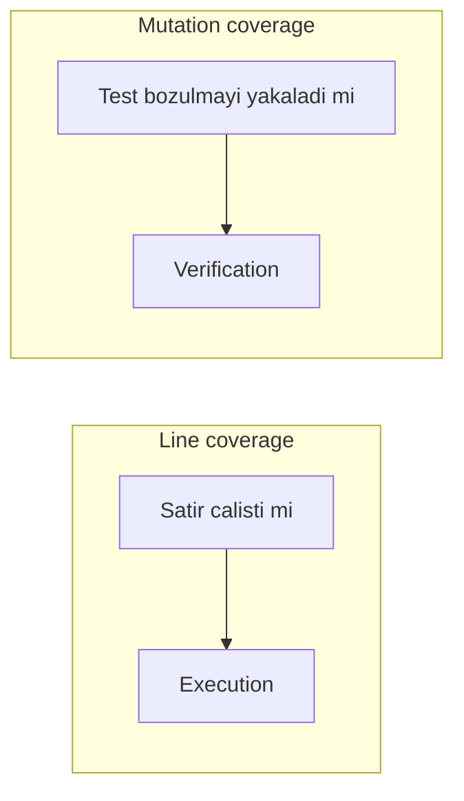
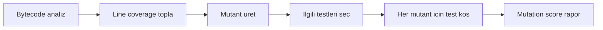
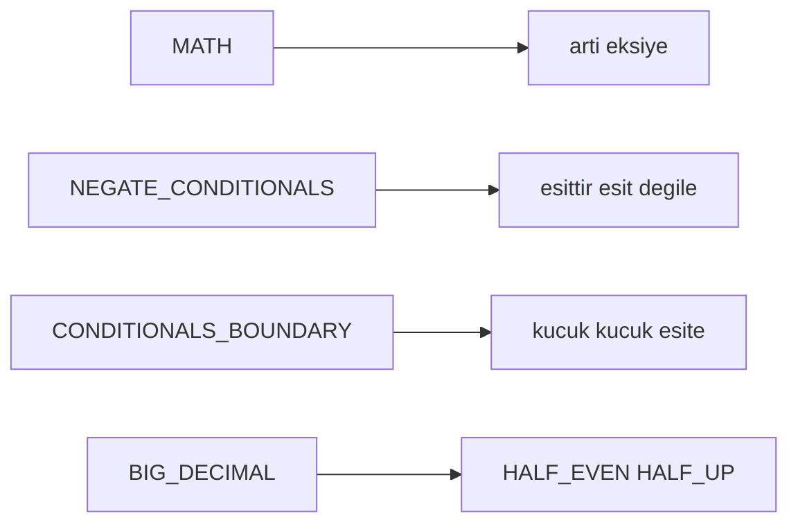

# Topic 12.6 — Mutation Testing: PIT

```admonish info title="Bu bölümde"
- Neden %85 line coverage'ın "iyi test" anlamına gelmediği ve mutation testing'in bunu nasıl kanıtladığı
- Killed vs survived mutant, mutation score ve banking için CI threshold gate mantığı
- PIT (Pitest) kurulumu: Maven plugin, JUnit 5, mutator tipleri (DEFAULTS vs STRONGER, banking için BIG_DECIMAL)
- Banking-critical sınıflarda (Interest, IBAN, Fraud) mutation'ı yakalayan güçlü test tasarımı
- Performans (incremental + git diff), equivalent mutant analizi ve 10 klasik anti-pattern
```

## Hedef

Mutation testing ile **test kalitesini** ölçmeyi öğrenmek: line coverage %85 olabilir ama mutation %50 ise test'ler aslında davranışı doğrulamıyordur. PIT'i banking projesine kurmak, mutator tiplerini ve mutation score'u okumak, kritik sınıflar için hedef belirlemek, CI gate ve performans ayarını yapmak, false positive'leri (equivalent mutant) analiz etmek.

## Süre

Okuma: 1.5 saat • Kendini Sına: 30 dk • Pratik (opsiyonel): 2-3 saat • Toplam: ~2 saat (+ pratik)

## Önbilgi

- JUnit 5 + Mockito (Topic 12.1, 12.2) bitti — test yazmak rahat
- Jacoco line coverage'ı gördün ve "coverage yüksek ama emin değilim" hissini tanıyorsun

---

## Kavramlar

### 1. Mutation testing — niye?

Test suite'in kendisini kim test ediyor? Line coverage bu soruya cevap veremez; mutation testing tam olarak bunun için var.

**Code coverage** sana "bu satır çalıştı" der, fazlasını değil. Aşağıdaki test coverage'ı %100'e taşır ama tek bir şey bile doğrulamaz:

```java
public int divide(int a, int b) {
    return a / b;
}

@Test
void test() {
    divide(10, 2);   // Coverage %100, assertion YOK
}
```

<mark>Coverage kodun çalıştığını ölçer, doğrulandığını değil</mark> — execution, not verification. İşte boşluk burada.

**Mutation testing** bu boşluğu doldurur: production kodunu kasıtlı olarak bozar (bir **mutant** üretir) ve test suite'in bunu fark edip etmediğine bakar. Mantık dört adımda döner:

1. Production kodda küçük bir değişiklik yap (mutant)
2. Test suite'i çalıştır
3. Test fail ederse mutant **killed** — test davranışı gerçekten doğruluyor, iyi
4. Test yeşil kalırsa mutant **survived** — test o değişikliği görmedi, davranışı doğrulamıyor, kötü


Yukarıdaki `divide` örneğine PIT birkaç mutant uygular ve zayıf test hepsini hayatta bırakır:

```
Original: return a / b;
Mutant 1: return a * b;   (replace / with *)
Mutant 2: return a + b;
Mutant 3: return a - b;
Mutant 4: return 0;

Test: assertEquals(5, divide(10, 2)) → mutant 1,2,3,4 killed.
Test: divide(10, 2) (assert yok)     → 0 mutant killed.

Mutation score = killed / total = 0/4 = %0
```

Line coverage ile mutation coverage aynı şeyi ölçmez; biri satırın çalışmasına, diğeri testin bozulmayı yakalamasına bakar:



```admonish warning title="Coverage'a güvenmek yanıltıcıdır"
%85 line coverage ≠ %85 test kalitesi. Assertion'ı zayıf veya hiç olmayan test'ler coverage'ı şişirir ama hiçbir mutant'ı öldürmez. Banking'de "coverage yüksek, demek ki güvendeyiz" cümlesi production'da yanlış hesaplanmış faiz olarak geri döner.
```

### 2. Mutation score — test kalitesinin metriği

Tek bir sayıya bakıp test suite'in ne kadar "gerçek" olduğunu görmek istiyorsun; bu sayı mutation score'dur.

<mark>Mutation score = killed mutant / total mutant</mark>. %100 tüm bozmaların yakalandığı, %0 hiçbirinin yakalanmadığı anlamına gelir. **Survival rate** ise tersidir: hayatta kalan mutant oranı, doğrudan test suite'indeki kör noktalara işaret eder.

Banking'de bu skor sadece raporlanmaz, bir **mutation threshold** olarak CI'da zorlanır — skor eşiğin altına düşerse build kırılır.

### 3. PIT (Pitest) — kurulum

PIT (Pitest) JVM ekosisteminde mutation testing'in fiili standardıdır; banking projelerinde Maven + JUnit 5 ile yaygın. Plugin'i ve JUnit 5 köprüsünü ekleyerek başlarsın:

```xml
<plugin>
    <groupId>org.pitest</groupId>
    <artifactId>pitest-maven</artifactId>
    <version>1.15.0</version>
    <dependencies>
        <dependency>
            <groupId>org.pitest</groupId>
            <artifactId>pitest-junit5-plugin</artifactId>
            <version>1.2.1</version>
        </dependency>
    </dependencies>
```

Ardından hangi sınıfların mutasyona uğrayacağını, hangi test'lerin koşacağını ve gate eşiklerini tanımlarsın. `mutationThreshold` banking gate'idir; altına düşerse build fail:

```xml
    <configuration>
        <targetClasses>
            <param>com.bank.transfer.domain.*</param>
            <param>com.bank.transfer.application.*</param>
        </targetClasses>
        <targetTests>
            <param>com.bank.transfer.*Test</param>
        </targetTests>
        <mutators>
            <mutator>DEFAULTS</mutator>
        </mutators>
        <mutationThreshold>80</mutationThreshold>   <!-- Banking gate -->
        <coverageThreshold>85</coverageThreshold>
        <outputFormats>
            <param>HTML</param>
            <param>XML</param>
        </outputFormats>
        <timestampedReports>false</timestampedReports>
    </configuration>
</plugin>
```

Çalıştırmak tek komut:

```bash
mvn org.pitest:pitest-maven:mutationCoverage
```

Çıktının kalbi Statistics bloğudur — üretilen mutant sayısı, killed oranı ve threshold karşısındaki PASS/FAIL:

```
================================================================================
- Statistics
================================================================================
>> Generated 234 mutations Killed 198 (85%)
>> Ran 312 tests (1.34 tests per mutation)
>> Mutation score: 85% (threshold 80) PASS
```

Detaylı, satır satır renklendirilmiş HTML rapor `target/pit-reports/index.html` altında; survived mutant'ları burada tek tek görürsün.

PIT motorunun içeride yaptığı iş şu akışa oturur:



Önce coverage toplaması, PIT'in her mutant için sadece o satırı çalıştıran test'leri koşmasını sağlar — bütün suite'i her mutant için baştan çalıştırmaz.

### 4. Mutator types

Mutant'ları üreten kurallara **mutator** denir; hangi mutator setini seçtiğin, test'inin ne kadar zorlanacağını doğrudan belirler. PIT'in standart (DEFAULTS) seti en yaygın bug sınıflarını hedefler:

| Mutator | Anlam |
|---|---|
| `CONDITIONALS_BOUNDARY` | `<` ↔ `<=` |
| `INCREMENTS` | `i++` ↔ `i--` |
| `INVERT_NEGS` | `-i` ↔ `i` |
| `MATH` | `+` ↔ `-`, `*` ↔ `/`, vb. |
| `NEGATE_CONDITIONALS` | `==` ↔ `!=`, `>` ↔ `<=` |
| `RETURN_VALS` | `return true` ↔ `return false`, vb. |
| `VOID_METHOD_CALLS` | void method çağrısını sil |
| `EMPTY_RETURNS` | `return ""` ↔ `return null` |
| `FALSE_RETURNS` | `return false` ↔ `return true` |
| `TRUE_RETURNS` | ters çevir |
| `NULL_RETURNS` | `return null` |
| `PRIMITIVE_RETURNS` | `return 0`, `return 1.0`, vb. |

Birkaç mutator'ün nasıl davrandığını gözde canlandırmak faydalı:



Banking için DEFAULTS yetmez; **STRONGER** seti daha agresif mutant'lar üretir:

```xml
<mutators>
    <mutator>STRONGER</mutator>
</mutators>
```

STRONGER, DEFAULTS'a şunları ekler: `EXPERIMENTAL_REMOVE_INCREMENTS`, `REMOVE_CONDITIONALS`, `EXPERIMENTAL_BIG_DECIMAL`, `EXPERIMENTAL_BIG_INTEGER`.

Bunlardan **BIG_DECIMAL** mutator banking için özellikle değerlidir çünkü para hesaplarının kalbini hedef alır: `BigDecimal.add()` → `subtract()`, veya `setScale(2, HALF_EVEN)` → `setScale(2, HALF_UP)` gibi rounding değişiklikleri. Zayıf test bu farkı görmez, güçlü test yakalar.

```admonish tip title="Banking'de STRONGER + BIG_DECIMAL kullan"
Para, faiz ve yuvarlama hesabı yapan modüllerde DEFAULTS ile yetinme. BIG_DECIMAL mutator HALF_EVEN → HALF_UP ve add → subtract gibi kuruş farkı yaratan bozmaları üretir; bunlar production'da regülatör bulgusu olabilecek hatalardır. STRONGER seti bu mutant'ları masaya koyar.
```

### 5. Banking-critical class analizi

Her sınıfa aynı mutation hedefini koymak gerçekçi değildir; iş kritikliğine göre önceliklendirirsin. Business logic taşıyan sınıflar yüksek çıtaya oturur:

- `LedgerService` (Topic 10.1)
- `InterestCalculator` (Topic 10.5)
- `FraudDetectionRule` (Topic 10.6)
- `AmortizationService`
- `IbanValidator` (Topic 10.4)
- `MaskingService` (PII), `EncryptionService`

<mark>Bu kritik hesaplama sınıflarında mutation score hedefi >= 90 olmalı</mark> — bir mutant'ın hayatta kalması burada gerçek para hatası riski demektir.

Buna karşılık DTO mapping, configuration ve logging gibi düşük riskli kod için %60-70 mutation kabul edilebilir; bunları %95'e zorlamak zaman israfıdır. Doğru mühendislik, çıtayı riske göre ayarlamaktır.

### 6. Target class selection

PIT'in neyi mutasyona uğratıp neyi dışarıda bırakacağını `targetClasses` ile bilinçli belirlersin — DTO ve config'i dışlamak hem hızı hem anlamlılığı artırır:

```xml
<targetClasses>
    <param>com.bank.transfer.domain.*</param>
    <param>com.bank.transfer.application.service.*</param>

    <excludedClasses>
        <param>*Dto</param>
        <param>*Config</param>
        <param>*Application</param>
    </excludedClasses>
</targetClasses>
```

### 7. Incremental analysis — performans

Full mutation run banking projelerinde 10-30 dakika sürer; her CI koşusunda bunu çalıştırmak boğar. PIT'in history dosyası, değişmeyen sınıfları atlayarak bunu çözer:

```xml
<configuration>
    <withHistory>true</withHistory>
    <historyInputFile>target/pit-history.bin</historyInputFile>
    <historyOutputFile>target/pit-history.bin</historyOutputFile>
</configuration>
```

Daha da agresifi, PR'da sadece **değişen kodu** mutasyona uğratmaktır (PIT 1.15+):

```xml
<features>
    <feature>+GIT(from=origin/main)</feature>
</features>
```

CI'da history cache ile birlikte:

```bash
mvn pitest:mutationCoverage -DwithHistory -DhistoryInputFile=cache/pit-history.bin
```

```admonish tip title="Incremental + git diff ikilisi"
Full mutation'ı nightly build'e, PR'lara ise `+GIT(from=origin/main)` ile diff-only + history cache koy. Böylece geliştirici her PR'da sadece kendi değişikliğinin mutation skorunu saniyeler içinde alır; tüm proje her seferinde yeniden mutasyona uğramaz.
```

### 8. Banking mutation örneği — kodu bozup test'i sınamak

Teoriyi somuta bağlayalım: gerçek bir faiz hesaplayıcı ve onu PIT gözüyle nasıl bozacağımız. İşte hedef kod:

```java
public class InterestCalculator {

    public BigDecimal computeInterest(BigDecimal principal, BigDecimal rate, int days) {
        return principal
            .multiply(rate)
            .multiply(BigDecimal.valueOf(days))
            .divide(BigDecimal.valueOf(365), 2, RoundingMode.HALF_EVEN);
    }
}
```

PIT bu dört satıra farklı mutant'lar uygular; her biri farklı bir test zaafını ortaya çıkarır:

1. `multiply(rate)` → `divide(rate)` — test yakalıyor mu?
2. `multiply(days)` → `multiply(days+1)` — edge case var mı?
3. `valueOf(365)` → `valueOf(360)` — ACT/360 vs ACT/365 test'i var mı?
4. `RoundingMode.HALF_EVEN` → `HALF_UP` — rounding test'i var mı?
5. `setScale(2, ...)` → `setScale(4, ...)` — precision test'i var mı?

Güçlü bir test suite beşini de öldürür; zayıf suite 2-3'ünü öldürür, gerisi survived kalır. Tek değere bakan bir test yetersizdir:

```java
@Test
void shouldCalculateInterest() {
    BigDecimal result = calc.computeInterest(
        new BigDecimal("100000"),
        new BigDecimal("0.05"),
        365);

    assertThat(result).isEqualByComparingTo("5000.00");
}
```

Bu test mutant 2'yi (days+1 → 5013.70) öldürür ama tek bir noktayı kontrol ettiği için mutant 3'ü (multiply vs divide) öldüremeyebilir. Çözüm, çok senaryolu parametrize test + rounding'i özel hedefleyen bir test:

```java
@ParameterizedTest
@CsvSource({
    "100000, 0.05, 365, 5000.00",     // tam yıl
    "100000, 0.05, 90,  1232.88",     // 90 gün
    "100000, 0.05, 0,   0.00",        // sıfır gün
    "100000, 0.10, 365, 10000.00",    // farklı oran
    "0,      0.05, 365, 0.00"         // sıfır anapara
})
void shouldCalculateInterestForVariousScenarios(...) {
    BigDecimal result = calc.computeInterest(...);
    assertThat(result).isEqualByComparingTo(expected);
}
```

Rounding mutant'ını (HALF_EVEN → HALF_UP) öldürmek için değeri özellikle 5'te biten bir senaryo seçersin:

```java
@Test
void shouldUseHalfEvenRounding() {
    // 100000 * 0.05 * 100 / 365 = 1369.86301...
    // HALF_EVEN → 1369.86 (5, çifte yuvarlar)
    // HALF_UP   → 1369.87 (mutant)
    BigDecimal result = calc.computeInterest(
        new BigDecimal("100000"), new BigDecimal("0.05"), 100);

    assertThat(result).isEqualByComparingTo("1369.86");
}
```

Artık mutant 3, 4 ve 5 de killed — mutation score tırmanır. Buradaki ders: mutant'ları öldürmek için test'i davranışa (day count convention, rounding mode) göre çeşitlendirirsin.

### 9. PIT CI integration

Mutation raporu ancak build'i kırdığında değer üretir; aksi halde kimse bakmaz. CI adımı PIT'i history cache ile koşar ve raporu artifact olarak yükler:

```yaml
- name: Mutation Testing
  run: |
    mvn -B pitest:mutationCoverage \
      -DwithHistory \
      -DhistoryInputFile=cache/pit-history.bin \
      -DhistoryOutputFile=cache/pit-history.bin

- name: Upload PIT report
  if: always()
  uses: actions/upload-artifact@v4
  with:
    name: pit-report
    path: target/pit-reports/
```

Eşik zorlaması için ya PIT'in kendi `mutationThreshold`'una güvenirsin (config'de tanımlıysa build otomatik fail olur) ya da XML'den skoru okuyup açıkça kontrol edersin:

```yaml
- name: Check mutation threshold
  run: |
    SCORE=$(xmllint --xpath "string(//mutationCoverage/totals/percentageMutationCoverage)" \
        target/pit-reports/mutations.xml)
    echo "Mutation score: $SCORE%"
    if (( $(echo "$SCORE < 80" | bc -l) )); then
      echo "Mutation score below threshold"
      exit 1
    fi
```

<mark>Threshold gate olmadan mutation raporu sadece dekordur</mark> — skor görünür ama kimseyi bağlamaz. Banking'de eşik CI'da zorlanmalı.

### 10. False positives — equivalent mutants

Bazı mutant'lar hiçbir test tarafından öldürülemez, çünkü orijinalle davranışsal olarak aynıdırlar; bunlara **equivalent mutant** denir. Klasik örnek:

```java
public int absoluteValue(int n) {
    if (n < 0) return -n;
    return n;
}

// Mutant: if (n <= 0) return -n;
```

`n=0` için orijinal `0`, mutant `-0 = 0` döner — davranış aynı, hiçbir test bu mutant'ı öldüremez. PIT bunu genelde survived gösterir; bu bir false positive'dir, test zaafı değil.

```admonish warning title="Equivalent mutant'ları körü körüne kovalama"
Her survived mutant test zaafı değildir. Equivalent mutant'ları %100 skora ulaşmak için öldürmeye çalışmak imkânsız ve zaman kaybıdır. Doğrusu: raporu incele, equivalent olanları tespit et, PIT config'inde suppress et ve gerekçesini dokümante et. %100 mutation score gerçekçi bir hedef değildir.
```

### 11. Banking anti-pattern'leri

Mutation testing'i yanlış kullanmanın on klasik yolu; mülakatta "bu yaklaşımda ne yanlış?" cephaneliği burasıdır:

1. **Coverage'a güvenmek** — %85 coverage ≠ %85 quality. Mutation kanıttır.
2. **All-or-nothing hedef** — tüm sınıflar %95+ gerçekçi değil. Kritik %90+, diğerleri %60+.
3. **Her CI koşusunda full mutation** — 10-30 dk. Incremental + git diff kullan.
4. **Equivalent mutant'ları görmezden gelmek** — false positive'leri incele, config'de suppress et.
5. **Test'i sırf mutant öldürmek için refactor etmek** — mutation-driven test bir smell'dir; test davranıştan doğmalı.
6. **Banking'de sadece default mutator** — BIG_DECIMAL kritik. STRONGER kullan.
7. **Getter/setter için PIT** — trivial kod, düşük değer. Exclude et.
8. **Threshold gate olmaması** — skor raporlanıp enforce edilmiyorsa boştur.
9. **İyi test olmadan mutation** — mutation test kalitesini ölçer; test hazır değilse rapor anlamsız.
10. **Mutation'ın diğer test'lerin yerine geçmesi** — mutation white-box'tır; integration / contract / e2e'nin yerini tutmaz.

```admonish warning title="Anti-pattern 5 en sinsisi"
Bir mutant survived kaldı diye test'e o mutant'ı öldürecek yapay bir assertion eklemek (örneğin bir ara değeri kontrol etmek) test kalitesini gerçekten artırmaz — test'i implementasyona bağlar, kırılgan yapar. Önce sor: "Bu mutant gerçek bir davranış farkı mı yaratıyor?" Evetse test'i davranış üzerinden güçlendir; hayırsa (equivalent) suppress et.
```

---

## Önemli olabilecek araştırma kaynakları

- PIT documentation — pitest.org
- "Mutation Testing for Java" — akademik makaleler
- pitest.org blog — mutator internals ve incremental analysis yazıları

---

## Kendini Sına

Aşağıdaki soruları önce **cevaba bakmadan** kendi cümlelerinle yanıtlamayı dene — hepsi test kalitesi ve mutation testing üzerine mülakatlarda çıkabilecek tarzda. Takıldığın soruda ilgili Kavramlar başlığına dön, sonra tekrar dene.

**S1. Line coverage %85 olan bir modülün test'leri neden hâlâ zayıf olabilir? Mutation testing bu zaafı nasıl ortaya çıkarır?**

<details>
<summary>Cevabı göster</summary>

Line coverage sadece "satır çalıştı mı" der; assertion olup olmadığını umursamaz. Assertion'ı zayıf veya hiç olmayan test'ler kodu çalıştırıp coverage'ı %85'e taşır ama davranışı doğrulamaz — execution var, verification yok.

Mutation testing production kodunu kasıtlı bozar (mutant üretir) ve test'in bunu fark edip etmediğine bakar. Zayıf test mutant'ı yakalayamaz (survived), güçlü test fail eder (killed). Böylece coverage'ın gizlediği kör noktalar sayısal olarak ortaya çıkar: %85 coverage + %50 mutation score = test'lerin yarısı davranışı doğrulamıyor demektir.

</details>

**S2. Killed mutant ile survived mutant arasındaki fark nedir? Survived bir mutant sana ne söyler?**

<details>
<summary>Cevabı göster</summary>

Mutant, production kodundaki küçük kasıtlı bir değişikliktir. Test suite mutant'lı kodda fail ederse mutant **killed** — test o davranış değişikliğini yakaladı, iyi. Test yeşil kalırsa mutant **survived** — test o bozmayı görmedi.

Survived bir mutant iki şeyden birini anlatır: ya test suite'inde bir kör nokta var (o davranışı doğrulayan assertion yok, test'i güçlendir), ya da mutant equivalent'tır (orijinalle aynı davranıyor, hiçbir test öldüremez, suppress et). İlk adım her survived mutant için "bu gerçek bir davranış farkı mı?" diye sormaktır.

</details>

**S3. Mutation score nasıl hesaplanır ve banking'de CI'da nasıl kullanılır?**

<details>
<summary>Cevabı göster</summary>

Mutation score = killed mutant / total mutant. %100 tüm bozmaların yakalandığı, %0 hiçbirinin yakalanmadığı anlamına gelir; survival rate ise tersidir (hayatta kalan oran). Skor, test suite'in gerçekten ne kadar doğrulama yaptığının tek sayılık ölçüsüdür.

Banking'de bu skor sadece raporlanmaz, `mutationThreshold` olarak CI'da zorlanır. Skor eşiğin (örneğin 80) altına düşerse PIT build'i kırar; ya PIT'in kendi threshold'una güvenirsin ya da XML raporundan skoru okuyup `exit 1` ile gate kurarsın. Gate olmadan skor sadece dekordur.

</details>

**S4. PIT mutator tipleri nelerdir? DEFAULTS ile STRONGER farkı ve banking için BIG_DECIMAL neden kritik?**

<details>
<summary>Cevabı göster</summary>

Mutator, mutant üreten kuraldır. DEFAULTS seti en yaygın bug sınıflarını hedefler: `MATH` (+↔-, *↔/), `NEGATE_CONDITIONALS` (==↔!=), `CONDITIONALS_BOUNDARY` (<↔<=), `RETURN_VALS`, `INCREMENTS` gibi. STRONGER bunlara daha agresif mutator'lar ekler: `REMOVE_CONDITIONALS`, `EXPERIMENTAL_BIG_DECIMAL`, `EXPERIMENTAL_BIG_INTEGER`.

Banking için **BIG_DECIMAL** özellikle değerlidir çünkü para hesabının kalbini hedefler: `add()` → `subtract()`, `setScale(2, HALF_EVEN)` → `setScale(2, HALF_UP)` gibi kuruş farkı yaratan bozmalar. DEFAULTS bunları üretmez; zayıf test bu farkı görmez. Faiz, yuvarlama ve para modüllerinde STRONGER + BIG_DECIMAL kullanmak, production'da regülatör bulgusu olabilecek hataları test'e taşır.

</details>

**S5. Banking'de tüm sınıflar için aynı mutation hedefini koymak neden yanlış? Nasıl önceliklendirirsin?**

<details>
<summary>Cevabı göster</summary>

Çünkü tüm sınıfları %95'e zorlamak gerçekçi değil ve zaman israfıdır (anti-pattern: all-or-nothing). Hedef iş kritikliğine göre ayarlanmalı.

Business logic taşıyan sınıflar yüksek çıtaya oturur: `LedgerService`, `InterestCalculator`, `FraudDetectionRule`, `IbanValidator`, `EncryptionService` gibi — bunlarda mutation score hedefi >= 90, çünkü hayatta kalan bir mutant gerçek para/güvenlik hatası riski demektir. Buna karşılık DTO mapping, configuration ve logging için %60-70 kabul edilebilir; hatta trivial getter/setter'ları PIT hedefinden tümüyle dışlamak (excludedClasses) doğrudur.

</details>

**S6. Equivalent mutant nedir? Neden %100 mutation score gerçekçi bir hedef değildir?**

<details>
<summary>Cevabı göster</summary>

Equivalent mutant, koda uygulandığında davranışı hiç değiştirmeyen mutant'tır — orijinalle aynı çıktıyı üretir, dolayısıyla hiçbir test onu öldüremez. Klasik örnek: `if (n < 0) return -n;` mutasyonu `if (n <= 0) return -n;` olduğunda `n=0` için ikisi de `0` döner.

PIT bunu survived gösterir ama bu bir test zaafı değil, false positive'dir. %100 mutation score, tüm equivalent mutant'ları da öldürmeyi gerektirir ki bu imkânsızdır. Doğru yaklaşım: raporu incele, equivalent olanları tespit et, PIT config'inde suppress et ve gerekçesini dokümante et. Bunları kovalamak yerine gerçek davranış farkı yaratan survived mutant'lara odaklanılır.

</details>

**S7. Full mutation run 20 dakika sürüyor ve her CI koşusunu yavaşlatıyor. Nasıl hızlandırırsın?**

<details>
<summary>Cevabı göster</summary>

İki mekanizma birleştirilir. Birincisi **incremental analysis**: `withHistory` ile PIT bir history dosyası tutar ve sonraki koşularda değişmeyen sınıfları atlar. İkincisi **git diff (PR-only)**: `+GIT(from=origin/main)` feature'ı ile PIT sadece PR'da değişen kodu mutasyona uğratır.

Pratik kurulum: full mutation'ı nightly build'e koy; PR'larda ise diff-only + history cache kullan. Böylece geliştirici her PR'da sadece kendi değişikliğinin skorunu saniyeler içinde alır, tüm proje her seferinde yeniden mutasyona uğramaz. Ayrıca DTO/config'i `excludedClasses` ile dışlamak ve getter/setter'ları hedeflememek de süreyi kısaltır.

</details>

---

## Tamamlama kriterleri

- [ ] Line coverage ile mutation coverage farkını (execution vs verification) 2 dakikada anlatabilirim
- [ ] Killed vs survived mutant ve mutation score hesabını açıklayabiliyorum
- [ ] PIT Maven plugin'i JUnit 5 + HTML/XML output ile kurabilirim
- [ ] DEFAULTS vs STRONGER farkını ve banking için BIG_DECIMAL'in önemini biliyorum
- [ ] Banking-critical sınıf listesini ve %90+ vs %60+ hedef ayrımını sayabiliyorum
- [ ] `mutationThreshold` CI gate'ini ve build fail mantığını açıklayabiliyorum
- [ ] Incremental + git diff (PR-only) ile performans optimizasyonunu kurabilirim
- [ ] Equivalent mutant'ın ne olduğunu ve neden suppress edildiğini biliyorum
- [ ] HALF_EVEN vs HALF_UP ve ACT/360 vs ACT/365 mutant'larını öldüren test tasarlayabilirim
- [ ] (Opsiyonel) "Pratik yapmak istersen" bölümündeki testleri yazdım ve Claude-verify prompt'uyla doğrulattım

---

## Defter notları

1. "Coverage vs mutation score — execution vs verification, banking sebebi: ____."
2. "Killed vs survived mutant + survival rate ne anlatır: ____."
3. "Mutation score hesabı + CI threshold gate: ____."
4. "DEFAULTS vs STRONGER + BIG_DECIMAL banking için neden kritik: ____."
5. "Banking critical class hedefi (Ledger, Interest, Fraud, IBAN) %90+ vs DTO %60+: ____."
6. "HALF_EVEN vs HALF_UP rounding mutant'ını öldüren test: ____."
7. "ACT/360 vs ACT/365 day count mutant'ını öldüren test: ____."
8. "Incremental + git diff (PR-only) PIT performansı: ____."
9. "Equivalent mutant false positive — tespit + suppress + dokümante: ____."
10. "Mutation = test quality metric, integration/e2e yerine geçmez: ____."

```admonish success title="Bölüm Özeti"
- Line coverage kodun çalıştığını, mutation testing test'in bozmayı yakaladığını ölçer — execution vs verification; %85 coverage %50 mutation olabilir
- Mutation score = killed / total mutant; survived mutant ya test kör noktasıdır ya equivalent'tır — CI'da `mutationThreshold` ile gate kurulur, gate yoksa skor dekordur
- PIT banking'in fiili standardı: Maven plugin + JUnit 5 + HTML/XML rapor; banking için STRONGER + BIG_DECIMAL mutator (HALF_EVEN→HALF_UP, add→subtract) kritik
- Hedef riske göre ayarlanır: Interest/Ledger/Fraud/IBAN gibi kritik sınıflar %90+, DTO/config %60+ veya excluded
- Performans için incremental (withHistory) + git diff (PR-only); full mutation nightly, PR'da diff-only
- Equivalent mutant'ları kovalama (suppress + dokümante); test'i sırf mutant öldürmek için refactor etme; mutation white-box'tır, integration/contract/e2e yerine geçmez
```

---

## Pratik yapmak istersen

Kavramları koda dökmek istersen aşağıdaki iki ek hazır: test yazma rehberi `InterestCalculator` için mutation'ı yakalayan güçlü bir test sınıfı içerir; Claude-verify prompt'u ile kurduğun mutation testing setup'ını banking-grade perspektiften denetletebilirsin.

<details>
<summary>Test yazma rehberi — mutation-strong InterestCalculatorTest</summary>

Aşağıdaki test sınıfı, Bölüm 8'deki beş mutant'ı (multiply/divide, days+1, ACT/360 vs 365, HALF_EVEN vs HALF_UP, precision) sistematik olarak öldürmek için tasarlandı. Önce parametrize senaryo matrisi:

```java
@DisplayName("InterestCalculator mutation-strong tests")
class InterestCalculatorTest {

    InterestCalculator calc = new InterestCalculator();

    @ParameterizedTest(name = "P={0} R={1} days={2} → I={3}")
    @CsvSource({
        "100000.00, 0.05, 365,  5000.00",
        "100000.00, 0.05, 90,   1232.88",
        "100000.00, 0.05, 1,    13.70",
        "100000.00, 0.05, 0,    0.00",
        "0,         0.05, 365,  0.00",
        "100000.00, 0,    365,  0.00",
        "100000.00, 0.10, 365,  10000.00",
        "100000.00, 0.05, 366,  5013.70",   // days+1 mutant'ını öldürür
        "100000.00, 0.05, 730,  10000.00"
    })
    void shouldCalculateInterest(BigDecimal p, BigDecimal r, int d, BigDecimal expected) {
        BigDecimal actual = calc.compute(p, r, d);
        assertThat(actual).isEqualByComparingTo(expected);
    }
```

Sonra rounding, day count ve boundary'yi ayrı ayrı hedefleyen test'ler — her biri belirli bir mutant sınıfını öldürür:

```java
    @Test
    @DisplayName("HALF_EVEN rounding kullanır — banker's rounding")
    void shouldRoundHalfEven() {
        // 100000 * 0.05 * 100 / 365 = 1369.86301...
        // HALF_EVEN → 1369.86, HALF_UP → 1369.87 (mutant)
        BigDecimal result = calc.compute(
            new BigDecimal("100000.00"), new BigDecimal("0.05"), 100);
        assertThat(result).isEqualByComparingTo("1369.86");
    }

    @Test
    @DisplayName("ACT/365 day count kullanır — ACT/360 değil")
    void shouldUse365DaysInYear() {
        // 100000 * 0.05 * 90 / 365 = 1232.88, ACT/360 → 1250.00 (mutant)
        BigDecimal result = calc.compute(
            new BigDecimal("100000.00"), new BigDecimal("0.05"), 90);
        assertThat(result).isEqualByComparingTo("1232.88");
    }

    @Test
    @DisplayName("Negatif gün reddedilir — input validation")
    void shouldRejectNegativeDays() {
        assertThatThrownBy(() -> calc.compute(
            new BigDecimal("100000"), new BigDecimal("0.05"), -1))
            .isInstanceOf(IllegalArgumentException.class);
    }
}
```

Bu sınıf için beklenen PIT skoru: **%95+**. Anahtar fikir, her test'in belirli bir davranış boyutunu (day count, rounding, boundary, validation) hedeflemesi — böylece ilgili mutant kaçamaz.

<details>
<summary>Tam kod: InterestCalculatorTest (~62 satır)</summary>

```java
@DisplayName("InterestCalculator mutation-strong tests")
class InterestCalculatorTest {

    InterestCalculator calc = new InterestCalculator();

    @ParameterizedTest(name = "P={0} R={1} days={2} → I={3}")
    @CsvSource({
        "100000.00, 0.05, 365,  5000.00",
        "100000.00, 0.05, 90,   1232.88",
        "100000.00, 0.05, 1,    13.70",
        "100000.00, 0.05, 0,    0.00",
        "0,         0.05, 365,  0.00",
        "100000.00, 0,    365,  0.00",
        "100000.00, 0.10, 365,  10000.00",
        "100000.00, 0.05, 366,  5013.70",   // days+1 mutant
        "100000.00, 0.05, 730,  10000.00"
    })
    void shouldCalculateInterest(BigDecimal p, BigDecimal r, int d, BigDecimal expected) {
        BigDecimal actual = calc.compute(p, r, d);
        assertThat(actual).isEqualByComparingTo(expected);
    }

    @Test
    @DisplayName("HALF_EVEN rounding kullanır — banker's rounding")
    void shouldRoundHalfEven() {
        // 100000 * 0.05 * 100 / 365 = 1369.86301...
        // HALF_EVEN → 1369.86 (son basamak çift)
        // HALF_UP   → 1369.87 (mutant)
        BigDecimal result = calc.compute(
            new BigDecimal("100000.00"), new BigDecimal("0.05"), 100);
        assertThat(result).isEqualByComparingTo("1369.86");
    }

    @Test
    @DisplayName("ACT/365 day count kullanır — ACT/360 değil")
    void shouldUse365DaysInYear() {
        // 100000 * 0.05 * 90 / 365 = 1232.88
        // ACT/360 → 1250.00 (mutant)
        BigDecimal result = calc.compute(
            new BigDecimal("100000.00"), new BigDecimal("0.05"), 90);
        assertThat(result).isEqualByComparingTo("1232.88");
    }

    @Test
    @DisplayName("Negatif gün reddedilir — input validation")
    void shouldRejectNegativeDays() {
        assertThatThrownBy(() -> calc.compute(
            new BigDecimal("100000"), new BigDecimal("0.05"), -1))
            .isInstanceOf(IllegalArgumentException.class);
    }

    @Test
    @DisplayName("1 gün boundary")
    void shouldHandleOneDayBoundary() {
        BigDecimal result = calc.compute(
            new BigDecimal("100000"), new BigDecimal("0.05"), 1);
        assertThat(result).isEqualByComparingTo("13.70");
    }
}
```

</details>

</details>

<details>
<summary>Claude-verify prompt</summary>

```
Mutation testing setup'ımı banking-grade kriterlere göre değerlendir.
Her madde için PASS / FAIL / EKSIK işaretle, kanıt göster, kod yazma:

1. PIT setup:
   - Maven plugin ekli mi?
   - JUnit 5 plugin ekli mi?
   - HTML + XML output tanımlı mı?

2. Mutators:
   - DEFAULTS mi STRONGER mı?
   - BIG_DECIMAL banking modülleri için aktif mi?
   - REMOVE_CONDITIONALS var mı?

3. Target selection:
   - Banking critical sınıflar hedefte mi (Ledger, Interest, Fraud, IBAN)?
   - DTO / Config / Application excluded mı?
   - Domain'e göre high vs medium öncelik ayrımı var mı?

4. Thresholds:
   - mutationThreshold (80+ önerilir) tanımlı mı?
   - coverageThreshold (85+) tanımlı mı?
   - Eşik altında CI gate fail ediyor mu?

5. Performans:
   - withHistory incremental aktif mi?
   - Git diff (PR-only) kullanılıyor mu?
   - CI'da PIT cache var mı?

6. Banking-strong tests:
   - InterestCalculator çok senaryolu parametrize mı?
   - Day count testi ACT/360 vs 365 mutant'ını öldürüyor mu?
   - Rounding testi HALF_EVEN vs HALF_UP mutant'ını öldürüyor mu?
   - IBAN check digit boundary testi var mı?
   - Fraud rule threshold testi var mı?

7. CI integration:
   - PIT CI'da koşuyor mu?
   - Rapor artifact olarak yükleniyor mu?
   - Eşik enforce ediliyor mu?
   - PR yorumu olarak mutation score paylaşılıyor mu?

8. False positives:
   - Equivalent mutant'lar review edilmiş mi?
   - Suppress kararları dokümante mi?

9. Banking critical yüzdeler:
   - Ledger %95+?
   - Interest calc %95+?
   - Fraud rule %90+?
   - DTO %60+ veya excluded?

10. Anti-pattern:
    - Coverage'a güvenip mutation atlama YOK mu?
    - Her CI koşusunda full mutation YOK mu?
    - Sırf mutant öldürmek için test refactor YOK mu?
    - Getter/setter için PIT YOK mu?
    - Threshold gate eksikliği YOK mu?
```

</details>
