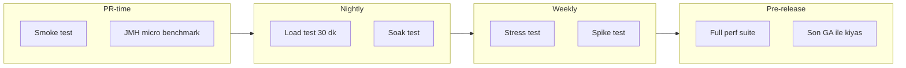
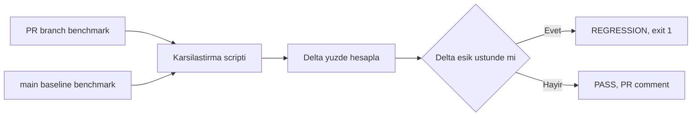
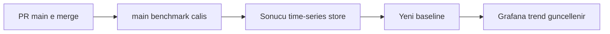

# Topic 12.7 — Performance Testing in CI

```admonish info title="Bu bölümde"
- Performance gate mantığı: benchmark çalıştır → baseline ile karşılaştır → threshold aşılırsa PR'ı blokla
- PR-time smoke, nightly load, pre-release full suite — her performance testinin pipeline'da doğru yeri
- JMH PR vs main regression tespiti + otomatik PR comment ile diff tablosu
- Baseline yönetimi: relative karşılaştırma, adaptive threshold, long-term time-series store ile silent regression avı
- Banking gerçekçiliği: SLO-driven k6 threshold'ları, endpoint mix, dedicated stable runner
```

## Hedef

CI/CD pipeline'ında performance regression'ı **otomatik** yakalayan bir sistem kurabilmek. Yeni bir commit p99'u yavaşlattığında bunu geceyi beklemeden PR'da fark eden bir gate tasarlamak: JMH benchmark PR vs main karşılaştırması, k6 smoke ve load testleri, baseline comparison ve threshold gate.

Ayrıca banking gerçekliğine oturtmak: SLO-driven test planı, gerçekçi load model (endpoint mix, think time, Pareto amount), dedicated stable runner, pre-release full suite ve yaygın anti-pattern'ler. Amaç, "performance test yazdım" değil, "performance regression üretim öncesi otomatik yakalanıyor" seviyesine ulaşmak.

## Süre

Okuma: 1.5 saat • Kendini Sına: 30 dk • Pratik (opsiyonel): 3-4 saat • Toplam: ~2 saat (+ pratik)

## Önbilgi

- Topic 9.6 (JMH Deep) bitti — benchmark yazıp `-rf json` ile sonuç dosyası üretebiliyorsun
- Topic 9.7 (Load Testing) bitti — k6 ile smoke/load/soak/stress ayrımını biliyorsun
- Topic 11.4 (CI/CD) bitti — GitHub Actions workflow, job, runner kavramları rahat

---

## Kavramlar

### 1. Pipeline'da performance test nerede çalışır

Her performance testini her commit'te çalıştıramazsın — bir load testi 30 dakika sürer, PR'ı bu kadar bekletemezsin. O yüzden testleri **maliyet/geri bildirim hızına** göre pipeline'ın farklı aşamalarına yerleştirirsin.

Hızlı ve ucuz olanlar PR-time'da, uzun ve pahalı olanlar nightly veya weekly'de, en kapsamlısı ise release öncesinde çalışır:



Kabaca yerleşim: **PR-time** = 1 kullanıcılı smoke + değişen kodun JMH benchmark'ı (saniyeler-dakikalar). **Nightly** = 30 dakika steady load + arka planda soak. **Weekly** = stress (breakpoint bulma) + spike (resilience). **Pre-release** = full suite + son GA sürümüyle karşılaştırma.

<mark>PR-time'daki JMH ve smoke bir CI gate olmalı, manuel bir adım değil</mark> — insan hatırlarsa çalıştırdığı test, regression'ı yakalamaz.

### 2. JMH in CI — PR vs main regression tespiti

Bir commit fonksiyonu %15 yavaşlattıysa bunu merge'den önce görmek istersin; bunun tek güvenilir yolu PR branch'in sonucunu main baseline'ıyla **aynı runner'da** karşılaştırmaktır. Mantık şu: iki kez benchmark çalıştır, delta yüzdesini hesapla, threshold aşılırsa gate'i düşür.



Workflow dedicated bir runner üzerinde önce PR branch'i build edip benchmark'ı çalıştırır:

```yaml
jmh-benchmark:
  runs-on: banking-benchmark-runner   # Dedicated, stable
  steps:
    - uses: actions/checkout@v4

    - name: Run benchmarks (PR branch)
      run: |
        ./mvnw -B clean package -DskipTests
        java -jar target/benchmarks.jar \
          -rf json -rff pr-result.json \
          -wi 5 -i 10 -f 2
```

Sonra aynı runner'da `origin/main`'e checkout edip baseline'ı üretir — aynı donanım, aynı JVM, sadece kod farklı:

```yaml
    - name: Get baseline (main)
      run: |
        git fetch origin main
        git checkout origin/main
        ./mvnw -B clean package -DskipTests
        java -jar target/benchmarks.jar \
          -rf json -rff main-result.json \
          -wi 5 -i 10 -f 2
```

İki JSON hazır olunca compare script'i delta'yı hesaplar ve threshold aşılırsa `exit 1` ile job'ı düşürür; sonucu bir PR comment'e yazar:

```yaml
    - name: Compare & gate
      run: |
        python scripts/compare-benchmark.py \
          --baseline main-result.json \
          --pr pr-result.json \
          --threshold 0.10 \
          --output diff.md

    - name: PR comment
      uses: actions/github-script@v7
      with:
        script: |
          const diff = require('fs').readFileSync('diff.md', 'utf8');
          github.rest.issues.createComment({
            issue_number: context.issue.number,
            owner: context.repo.owner, repo: context.repo.repo,
            body: '## Benchmark Result\n\n' + diff
          });
```

<details>
<summary>Tam kod: jmh-benchmark workflow (~43 satır)</summary>

```yaml
jmh-benchmark:
  runs-on: banking-benchmark-runner   # Dedicated, stable
  steps:
    - uses: actions/checkout@v4

    - name: Run benchmarks (PR branch)
      run: |
        ./mvnw -B clean package -DskipTests
        java -jar target/benchmarks.jar \
          -rf json -rff pr-result.json \
          -wi 5 -i 10 -f 2

    - name: Get baseline (main)
      run: |
        git fetch origin main
        git checkout origin/main
        ./mvnw -B clean package -DskipTests
        java -jar target/benchmarks.jar \
          -rf json -rff main-result.json \
          -wi 5 -i 10 -f 2

    - name: Compare & gate
      run: |
        python scripts/compare-benchmark.py \
          --baseline main-result.json \
          --pr pr-result.json \
          --threshold 0.10 \
          --output diff.md
        cat diff.md

    - name: PR comment
      uses: actions/github-script@v7
      with:
        script: |
          const fs = require('fs');
          const diff = fs.readFileSync('diff.md', 'utf8');
          github.rest.issues.createComment({
            issue_number: context.issue.number,
            owner: context.repo.owner,
            repo: context.repo.repo,
            body: '## Benchmark Result\n\n' + diff
          });
```

</details>

Compare script'in kalbi: iki sonucu benchmark adına göre map'le, her benchmark için delta hesapla. Önce argümanlar ve iki JSON'un yüklenmesi:

```python
#!/usr/bin/env python3
import json, sys, argparse

ap = argparse.ArgumentParser()
ap.add_argument('--baseline', required=True)
ap.add_argument('--pr', required=True)
ap.add_argument('--threshold', type=float, default=0.10)
ap.add_argument('--output')
args = ap.parse_args()

baseline_by_name = {b['benchmark']: b for b in json.load(open(args.baseline))}
pr_by_name = {p['benchmark']: p for p in json.load(open(args.pr))}
```

Asıl karar burada: her benchmark için `delta = (pr - baseline) / baseline`. Delta threshold'u aşarsa REGRESSION, `failures` listesine eklenir; %5'ten fazla iyileşme "improved" olarak işaretlenir:

```python
failures = []
for name, pr_data in pr_by_name.items():
    pr_score = pr_data['primaryMetric']['score']
    baseline_data = baseline_by_name.get(name)
    if not baseline_data:
        continue                                  # NEW benchmark, baseline yok
    baseline_score = baseline_data['primaryMetric']['score']
    delta = (pr_score - baseline_score) / baseline_score
    if delta > args.threshold:
        failures.append((name, delta * 100))      # regression
```

Regression varsa script `exit(1)` ile döner — CI job'ının fail olmasını ve gate'in kapanmasını bu tek satır sağlar:

```python
if failures:
    print("\nRegressions detected:")
    for name, pct in failures:
        print(f"  {name}: +{pct:.1f}%")
    sys.exit(1)
```

<details>
<summary>Tam kod: compare-benchmark.py (~53 satır)</summary>

```python
#!/usr/bin/env python3
import json, sys, argparse

ap = argparse.ArgumentParser()
ap.add_argument('--baseline', required=True)
ap.add_argument('--pr', required=True)
ap.add_argument('--threshold', type=float, default=0.10)
ap.add_argument('--output')
args = ap.parse_args()

baseline = json.load(open(args.baseline))
pr = json.load(open(args.pr))

baseline_by_name = {b['benchmark']: b for b in baseline}
pr_by_name = {p['benchmark']: p for p in pr}

table = "| Benchmark | Baseline (ns/op) | PR (ns/op) | Δ% | Status |\n"
table += "|---|---|---|---|---|\n"

failures = []

for name, pr_data in pr_by_name.items():
    pr_score = pr_data['primaryMetric']['score']
    baseline_data = baseline_by_name.get(name)

    if not baseline_data:
        table += f"| {name} | NEW | {pr_score:.2f} | - | ⊕ new |\n"
        continue

    baseline_score = baseline_data['primaryMetric']['score']
    delta = (pr_score - baseline_score) / baseline_score

    status = "✓"
    if delta > args.threshold:
        status = "❌ REGRESSION"
        failures.append((name, delta * 100))
    elif delta < -0.05:
        status = "⚡ improved"

    table += f"| {name} | {baseline_score:.2f} | {pr_score:.2f} | {delta*100:+.1f}% | {status} |\n"

if args.output:
    with open(args.output, 'w') as f:
        f.write(table)

print(table)

if failures:
    print("\nRegressions detected:")
    for name, pct in failures:
        print(f"  {name}: +{pct:.1f}%")
    sys.exit(1)
```

</details>

Ürettiği PR comment tam olarak şuna benzer — `ledgerPost` %15.3 yavaşladığı için gate kapanır:

```
## Benchmark Result

| Benchmark | Baseline (ns/op) | PR (ns/op) | Δ% | Status |
|---|---|---|---|---|
| moneyAdd | 45.23 | 47.10 | +4.1% | ✓ |
| moneyMultiply | 120.45 | 119.80 | -0.5% | ✓ |
| ledgerPost | 8500.12 | 9800.34 | +15.3% | ❌ REGRESSION |
```

```admonish tip title="Neden aynı runner'da iki kez"
Baseline'ı bir dosyaya kaydedip günlerce kullanmak cazip görünür ama tehlikelidir: runner'ın CPU'su, JVM sürümü, arka plan yükü değişince absolute ns/op değerleri kayar ve false positive üretir. PR ile baseline'ı **aynı job içinde peş peşe** çalıştırmak, ortam farkını sıfırlar; geriye sadece kod farkı kalır.
```

### 3. k6 smoke test — her PR'da sanity

Micro benchmark method-level hızı ölçer ama endpoint gerçekten ayakta mı, p95 makul mü — bunu 1 kullanıcılı bir k6 smoke söyler. PR preview deploy edilince çalışır, saniyeler sürer:

```yaml
smoke-test:
  runs-on: ubuntu-latest
  needs: [build, deploy-pr-preview]
  steps:
    - uses: actions/checkout@v4

    - name: k6 smoke
      uses: grafana/k6-action@v0.3.1
      with:
        filename: tests/perf/smoke.js
        flags: --env BASE_URL=${{ env.PR_PREVIEW_URL }}

    - name: Archive results
      if: always()
      uses: actions/upload-artifact@v4
      with:
        name: k6-smoke-${{ github.sha }}
        path: results.json
```

Smoke script'inde `thresholds` bloğu gate'i tanımlar: p95 < 1s ve hata oranı < %1 aşılırsa k6 non-zero exit döner ve job düşer.

```javascript
// tests/perf/smoke.js
import http from 'k6/http';
import { check } from 'k6';

export const options = {
  vus: 1,
  duration: '30s',
  thresholds: {
    http_req_duration: ['p(95)<1000'],
    http_req_failed: ['rate<0.01'],
  },
};

export default function () {
  const health = http.get(`${__ENV.BASE_URL}/actuator/health`);
  check(health, { 'health up': r => r.status === 200 });
}
```

### 4. Nightly load test — steady 30 dakika

Load test PR'ı 30 dakika bekletemeyeceğin kadar uzun, ama regression'ı da her gece görmek istersin — çözüm cron ile geceye kaydırmak. Trigger hem schedule hem manuel dispatch:

```yaml
# .github/workflows/nightly-load-test.yml
name: Nightly Load Test
on:
  schedule:
    - cron: '0 2 * * *'   # 02:00 UTC
  workflow_dispatch:
jobs:
  load-test:
    runs-on: banking-perf-runner
    timeout-minutes: 60
```

Load test'in güvenilir olması için ortamın **temiz ve tohumlanmış** olması şart: staging'i yeniden deploy et, healthy olmasını bekle, test datasını seed et:

```yaml
    steps:
      - uses: actions/checkout@v4
      - name: Deploy staging refresh
        run: kubectl apply -k k8s/staging
      - name: Wait healthy
        run: kubectl wait --for=condition=ready pod -l app=banking-api -n staging --timeout=300s
      - name: Seed test data
        run: ./scripts/seed-perf-data.sh staging
```

Sonra k6 load'u Docker ile çalıştır, sonucu analiz et ve son başarılı run'ın baseline'ı ile karşılaştır:

```yaml
      - name: Run k6 load test
        run: |
          docker run --rm -v $(pwd):/scripts grafana/k6 run \
            -e BASE_URL=https://staging.mavibank.com \
            --out json=results.json /scripts/tests/perf/load.js
      - name: Compare to baseline
        run: |
          python scripts/compare-load.py \
            --baseline baseline.json --current results.json --threshold 0.10
      - name: Slack
        if: failure()
        uses: 8398a7/action-slack@v3
        with:
          status: ${{ job.status }}
          channel: '#banking-perf'
```

<details>
<summary>Tam kod: nightly-load-test.yml (~60 satır)</summary>

```yaml
# .github/workflows/nightly-load-test.yml
name: Nightly Load Test

on:
  schedule:
    - cron: '0 2 * * *'   # 02:00 UTC
  workflow_dispatch:

jobs:
  load-test:
    runs-on: banking-perf-runner
    timeout-minutes: 60

    steps:
      - uses: actions/checkout@v4

      - name: Deploy staging refresh
        run: kubectl apply -k k8s/staging

      - name: Wait healthy
        run: kubectl wait --for=condition=ready pod -l app=banking-api -n staging --timeout=300s

      - name: Seed test data
        run: ./scripts/seed-perf-data.sh staging

      - name: Run k6 load test
        run: |
          docker run --rm -v $(pwd):/scripts grafana/k6 run \
            -e BASE_URL=https://staging.mavibank.com \
            --out json=results.json \
            /scripts/tests/perf/load.js

      - name: Analyze + threshold
        run: |
          python scripts/analyze-load-test.py results.json

      - name: Upload report
        if: always()
        uses: actions/upload-artifact@v4
        with:
          name: load-test-${{ github.run_number }}
          path: |
            results.json
            report.html

      - name: Compare to baseline (last successful run)
        run: |
          python scripts/compare-load.py \
            --baseline baseline.json \
            --current results.json \
            --threshold 0.10

      - name: Slack
        if: failure()
        uses: 8398a7/action-slack@v3
        with:
          status: ${{ job.status }}
          channel: '#banking-perf'
```

</details>

### 5. SLO-driven test plan

Bir load testinin "geçti/kaldı" eşiği havadan seçilmemeli; production'da müşteriye verdiğin SLO ile **birebir aynı** olmalı. Önce SLO'yu config-as-code tanımlarsın:

```yaml
# slo.yml
slos:
  transfer-service:
    - name: transfer_p99_latency
      target: 1000ms
    - name: transfer_error_rate
      target: 0.005
    - name: transfer_throughput
      target: 1000 rps
```

k6 script'inde custom metric tanımlar ve threshold'ları bu SLO değerlerine bağlarsın — böylece "test geçti" ile "SLO tutuyor" aynı şey olur. Önce metric'ler ve senaryo:

```javascript
// tests/perf/load.js
import http from 'k6/http';
import { check } from 'k6';
import { Trend, Rate } from 'k6/metrics';

const transferDuration = new Trend('banking_transfer_duration');
const transferErrors = new Rate('banking_transfer_errors');

export const options = {
  scenarios: {
    transfer_load: {
      executor: 'ramping-arrival-rate',
      startRate: 0, timeUnit: '1s',
      preAllocatedVUs: 200, maxVUs: 1000,
      stages: [
        { duration: '5m', target: 1000 },   // ramp to 1000 RPS
        { duration: '30m', target: 1000 },  // sustain
        { duration: '5m', target: 0 },
      ],
    },
  },
```

Threshold'lar doğrudan SLO'yu yansıtır — p99 < 1s ve error < %0.5 aşılırsa test fail:

```javascript
  thresholds: {
    banking_transfer_duration: ['p(99)<1000'],   // SLO match
    banking_transfer_errors: ['rate<0.005'],     // SLO match
    http_req_failed: ['rate<0.01'],
  },
};

export default function () {
  const start = Date.now();
  const res = http.post('https://staging/v1/transfers/havale', body, headers);
  transferDuration.add(Date.now() - start);
  transferErrors.add(res.status >= 400);
  check(res, { 'status 200/201': r => r.status === 200 || r.status === 201 });
}
```

<details>
<summary>Tam kod: SLO-driven load.js (~42 satır)</summary>

```javascript
// tests/perf/load.js
import http from 'k6/http';
import { check } from 'k6';
import { Trend, Rate } from 'k6/metrics';

const transferDuration = new Trend('banking_transfer_duration');
const transferErrors = new Rate('banking_transfer_errors');

export const options = {
  scenarios: {
    transfer_load: {
      executor: 'ramping-arrival-rate',
      startRate: 0,
      timeUnit: '1s',
      preAllocatedVUs: 200,
      maxVUs: 1000,
      stages: [
        { duration: '5m', target: 1000 },   // ramp to 1000 RPS
        { duration: '30m', target: 1000 },  // sustain
        { duration: '5m', target: 0 },
      ],
    },
  },
  thresholds: {
    banking_transfer_duration: ['p(99)<1000'],   // SLO match
    banking_transfer_errors: ['rate<0.005'],     // SLO match
    http_req_failed: ['rate<0.01'],
  },
};

export default function () {
  const start = Date.now();
  const res = http.post('https://staging/v1/transfers/havale', body, headers);

  transferDuration.add(Date.now() - start);
  transferErrors.add(res.status >= 400);

  check(res, {
    'status 200/201': r => r.status === 200 || r.status === 201,
  });
}
```

</details>

### 6. Banking gerçekçi load model

Her VU'nun düz `havale POST` atması gerçek trafiği taklit etmez; production'da kullanıcılar düşünür (think time), çoğu işlem küçük tutarlı, endpoint dağılımı dengesizdir. Bunları modellemezsen "geçti" dediğin test yanıltıcıdır.

Think time çoğunlukla kısa, arada uzun — sabit değil, dağılımlı:

```javascript
import { randomIntBetween } from 'https://jslib.k6.io/k6-utils/1.4.0/index.js';

function bankingThinkTime() {
  // 70% quick (1-3 sec), 25% medium (5-15), 5% slow (30+)
  const r = Math.random();
  if (r < 0.70) return randomIntBetween(1, 3);
  if (r < 0.95) return randomIntBetween(5, 15);
  return randomIntBetween(30, 90);
}
```

Tutar Pareto-benzeri: çoğu küçük, azı büyük — ortalama tek bir sabit tutarla test etmek DB indeks/lock davranışını gizler:

```javascript
function bankingAmount() {
  const r = Math.random();
  if (r < 0.60) return randomIntBetween(50, 500);
  if (r < 0.90) return randomIntBetween(500, 5000);
  if (r < 0.99) return randomIntBetween(5000, 50000);
  return randomIntBetween(50000, 200000);
}
```

Endpoint mix gerçek trafiği yansıtır — balance sorgusu transfer'den kat kat fazla çağrılır:

```javascript
function bankingEndpointMix() {
  const r = Math.random();
  if (r < 0.50) return 'account-balance';
  if (r < 0.75) return 'transaction-history';
  if (r < 0.90) return 'transfer';
  if (r < 0.97) return 'card-info';
  return 'profile';
}
```

```admonish warning title="Tek endpoint + sabit tutar = yalancı test"
Sadece transfer endpoint'ini sabit 100 TL ile döven bir test, cache hit oranını yapay yükseltir ve DB'nin gerçek yük altında nasıl davrandığını gizler. Endpoint mix, amount dağılımı ve think time olmadan ölçtüğün p99, production p99'unu tahmin etmez.
```

### 7. Baseline trend store — silent regression avı

Tek bir PR %2 yavaşlarsa gate açılır, sorun yok. Ama 20 PR üst üste %2 yavaşlarsa aylar içinde 2 kat yavaşlarsın ve hiçbir gate bunu görmez — buna **silent regression** denir. Çözüm: her sonucu uzun ömürlü bir time-series store'a itmek.



Her main benchmark sonucunu Victoria Metrics / Prometheus'a push edersin:

```python
# scripts/push-to-grafana.py
import json, requests, time

results = json.load(open('pr-result.json'))

for r in results:
    requests.post('http://victoria-metrics:8428/api/v1/import',
        json={
            'metric': {'__name__': 'jmh_benchmark', 'benchmark': r['benchmark']},
            'values': [r['primaryMetric']['score']],
            'timestamps': [int(time.time() * 1000)]
        })
```

Grafana panelinde benchmark trend'ini aylar boyunca izlersin; yavaş yavaş yükselen bir çizgi, hiçbir tek PR'ın yakalayamadığı silent regression'ın imzasıdır.

<mark>Karşılaştırma her zaman aynı ortamdaki baseline'a göre relative olmalı, absolute ns/op değerlerine göre değil</mark> — çünkü absolute değer runner'a bağlıdır, relative delta koda.

### 8. Pre-release perf gate — full suite

Major bir sürüm çıkarken tek bir smoke yetmez; smoke + load + stress + spike + soak'ı zincirleyip son GA sürümüyle karşılaştırır, regression varsa release'i bloklarsın. Önce full suite zinciri:

```yaml
- name: Full perf suite
  run: |
    k6 run tests/perf/smoke.js
    k6 run tests/perf/load.js
    k6 run tests/perf/stress.js
    k6 run tests/perf/spike.js
    k6 run tests/perf/soak.js
```

Sonra sonucu son GA baseline'ı ile karşılaştırır ve regression bayrağına göre release kararı verirsin — `exit 1` release'i durdurur:

```yaml
- name: Compare to last GA
  run: python scripts/compare-perf.py --baseline ga-1.0.json --current run.json

- name: Release decision
  run: |
    if [ "$REGRESSION" = "true" ]; then
      echo "❌ Performance regression — release blocked"
      exit 1
    fi
```

### 9. Dedicated CI runner — stable ortam

Benchmark ölçümünün en büyük düşmanı gürültüdür: paylaşımlı bir CI runner'da başka job'lar CPU çalarsa aynı kod bir gün 45 ns, ertesi gün 60 ns ölçülür ve false positive üretir. O yüzden benchmark'lar dedicated, izole bir runner'da koşar.

```yaml
# self-hosted runner config
labels: [self-hosted, banking-benchmark-runner]

# Setup:
# - bare metal (no virtualization noise)
# - CPU pinning (taskset)
# - turbo boost disabled   (deterministik frekans)
# - no other workloads
# - same JVM version, same OS

cpu_setup() {
  echo 1 | sudo tee /sys/devices/system/cpu/intel_pstate/no_turbo
  sudo cpupower frequency-set -g performance
  for cpu in 4-7; do
    echo 0 | sudo tee /sys/devices/system/cpu/cpu${cpu}/online
  done
}
```

Turbo boost'u kapatmak sezgiye aykırı gelir ("daha hızlı olsun istemez miyiz?") ama amaç hız değil **tekrarlanabilirlik**: turbo, sıcaklığa göre frekansı oynatır ve ölçümü rastgeleleştirir.

```admonish warning title="Shared runner = false positive fabrikası"
Benchmark'ı paylaşımlı GitHub-hosted runner'da çalıştırırsan komşu job'ların yükü ölçüme sızar. Sonuç: gerçek olmayan regression alarmları ekibi köreltir, bir süre sonra kimse gate'e bakmaz. Banking'de dedicated runner lüks değil, gate'in güvenilirliğinin ön koşuludur.
```

### 10. Banking — perf testing CI anti-pattern'leri

Mülakatta "bu perf setup'ta ne yanlış?" sorusunun cephaneliği burası. On klasik:

**1. Performance test sadece manuel** — regression sızar. CI gate şart.

**2. Shared CI runner** — gürültü, false positive. Dedicated runner.

**3. Hardcoded absolute threshold** — kod iyileşince eşik elle düşürülür, sonra kimse ayarlamaz, tespit ölür. Adaptive: baseline'ın yüzdesi.

**4. Sadece smoke test** — yeterli değil. Load + soak + stress gerekir.

**5. Production'da test** — gerçek müşteri etkisi. Staging'i gerçekçi klonla.

**6. Absolute sayı karşılaştırma** — ortama bağlı. Aynı ortamdaki baseline'a relative karşılaştır.

**7. Baseline saklamama** — her run izole, trend kaybolur. Time-series store.

**8. Tek warmup iteration** — JIT stabil değil. Min 5 warmup iteration.

**9. Benchmark'ı main thread'de çalıştırma** — non-deterministik. Dedicated JMH config, fork.

**10. Threshold çok gevşek** — %50 regression bile geçer. Banking standardı: %10 threshold.

Bu on maddenin ortak paydası tek cümlede toplanır: <mark>performance gate otomatik, dedicated runner'da ve aynı ortamdaki baseline'a relative çalışmalı</mark> — bu üçü yoksa gate ya sızdırır ya da false positive üretir.

---

## Önemli olabilecek araştırma kaynakları

- "Java Performance" — Scott Oaks (benchmark ve JVM tuning)
- JMH official samples (regression detection pattern'leri)
- k6 documentation (thresholds, scenarios, custom metrics)
- Grafana Cloud k6 (managed load testing)
- Continuous benchmark patterns (GitHub Action ekosistemi)

---

## Kendini Sına

Aşağıdaki soruları önce **cevaba bakmadan** kendi cümlelerinle yanıtlamayı dene — hepsi banking backend/SRE mülakatlarında karşına çıkabilecek tarzda. Takıldığın soru olursa ilgili Kavramlar başlığına dön, sonra tekrar dene.

**S1. Performance gate nasıl çalışır? Adım adım anlat.**

<details>
<summary>Cevabı göster</summary>

Gate üç adımlı bir döngüdür: (1) benchmark veya load testini çalıştır ve metriği ölç, (2) ölçümü bir baseline ile karşılaştırıp delta yüzdesini hesapla, (3) delta önceden belirlenmiş threshold'u (banking'de %10) aşarsa job'ı non-zero exit ile düşür.

Kritik nokta bunun bir insan adımı değil CI adımı olmasıdır: compare script `sys.exit(1)` döndürünce GitHub Actions job fail olur, PR merge butonu kilitlenir. Böylece "test çalıştırmayı unuttum" senaryosu ortadan kalkar; regression'ı yakalamak insanın hafızasına değil pipeline'a bağlıdır.

</details>

**S2. Baseline karşılaştırmasında neden absolute değil relative değer kullanılır, ve neden aynı ortamda ölçülür?**

<details>
<summary>Cevabı göster</summary>

Absolute ns/op değeri runner'a bağlıdır: CPU modeli, JVM sürümü, arka plan yükü, turbo durumu değişince aynı kod farklı sayılar üretir. Bir dosyaya "baseline = 45 ns" yazıp haftalarca kullanırsan, ortam kaydığı anda false positive (veya false negative) alırsın.

Doğrusu, PR ve baseline benchmark'larını **aynı job içinde peş peşe** aynı runner'da çalıştırmak. Böylece ortam farkı iki ölçümde de aynıdır ve iptal olur; geriye sadece kod farkı kalır. Karşılaştırma da `(pr - baseline) / baseline` gibi relative bir delta üzerinden yapılır — bu delta ortamdan bağımsızdır.

</details>

**S3. JMH ile bir PR'da regression nasıl tespit edilir?**

<details>
<summary>Cevabı göster</summary>

PR branch'i build edip benchmark'ı `-rf json` ile bir dosyaya yazarsın. Sonra aynı runner'da `origin/main`'e checkout edip aynı benchmark'ı ikinci bir dosyaya yazarsın — bu baseline'dır. Bir compare script iki JSON'u benchmark adına göre eşleştirir ve her biri için `delta = (pr_score - baseline_score) / baseline_score` hesaplar.

Delta threshold'u (örn. 0.10) aşan her benchmark bir regression'dır; script bunları toplar, PR comment olarak diff tablosu yazar ve en az bir regression varsa `exit 1` ile CI'ı düşürür. Yeni eklenen benchmark'ların baseline'ı olmadığı için "NEW" işaretlenip gate dışında tutulur.

</details>

**S4. Bir performance testini CI pipeline'ında nereye koyarsın? Neye göre karar verirsin?**

<details>
<summary>Cevabı göster</summary>

Karar kriteri testin süresi ile istediğin geri bildirim hızıdır. Saniyeler/dakikalar süren, hızlı feedback gereken testler PR-time'da çalışır: 1 kullanıcılı k6 smoke + değişen kodun JMH benchmark'ı, ikisi de gate.

Uzun ve pahalı testler geceye/haftaya kayar: 30 dakikalık steady load ve soak nightly, breakpoint bulan stress ve resilience ölçen spike weekly. En kapsamlısı olan full suite (smoke + load + stress + spike + soak) yalnızca pre-release'de, son GA ile karşılaştırmalı çalışır. Böylece PR'ı bekletmeden hızlı sinyal alır, derin regression'ları da uygun aralıklarla yakalarsın.

</details>

**S5. Neden benchmark'lar dedicated runner'da çalıştırılır? Hangi ayarlar yapılır?**

<details>
<summary>Cevabı göster</summary>

Çünkü ölçümün düşmanı gürültüdür. Paylaşımlı runner'da komşu job'lar CPU çalınca aynı kod bir gün 45 ns, ertesi gün 60 ns ölçülür — bu da false positive regression alarmları demektir ve zamanla ekip gate'e güvenmeyi bırakır.

Dedicated runner tekrarlanabilirlik için ayarlanır: bare metal (virtualization gürültüsü yok), CPU pinning (taskset ile belirli çekirdeklere sabitleme), turbo boost kapalı (frekans sıcaklığa göre oynamasın), performance governor, aynı JVM ve OS, ve o runner'da başka iş yok. JMH tarafında da min 5 warmup iteration ve fork ile JIT'in stabil hale gelmesi sağlanır.

</details>

**S6. SLO-driven threshold ne demek? Örnek ver.**

<details>
<summary>Cevabı göster</summary>

SLO-driven threshold, load testinin "geçti/kaldı" eşiğinin production'da müşteriye verdiğin SLO ile birebir aynı olması demektir. Eşiği havadan seçmek yerine, SLO'yu `slo.yml` gibi config-as-code tutar ve k6 threshold'larını bu değerlere bağlarsın.

Örnek: transfer SLO'su p99 < 1000ms ve error rate < %0.5 ise, k6 script'inde `banking_transfer_duration: ['p(99)<1000']` ve `banking_transfer_errors: ['rate<0.005']` yazarsın. Böylece "test geçti" ile "SLO tutuyor" tam olarak aynı cümle olur; test yeşilse üretimde de SLO'yu karşılayacağına güvenirsin.

</details>

**S7. Silent regression nedir, nasıl yakalanır?**

<details>
<summary>Cevabı göster</summary>

Silent regression, tek tek hiçbir PR gate'i tetiklemeyen ama zamanla biriken yavaşlamadır. Örneğin 20 PR üst üste %2 yavaşlarsa (her biri %10 threshold'un altında kalır) aylar içinde sistem 2 katına yavaşlar ve hiçbir gate bunu görmez.

Yakalamak için her main benchmark sonucunu uzun ömürlü bir time-series store'a (Prometheus / Victoria Metrics) push edersin ve Grafana'da benchmark trend'ini aylar boyunca izlersin. Yavaş yavaş yükselen bir çizgi, tek PR'ların gizlediği regression'ın imzasıdır. PR-time gate ani sıçramaları, trend paneli ise yavaş sürüklenmeyi yakalar — ikisi birbirini tamamlar.

</details>

---

## Tamamlama kriterleri

- [ ] "Kendini Sına" bölümündeki tüm soruları cevaba bakmadan açıklayabiliyorum
- [ ] Performance gate'in üç adımını (çalıştır → baseline karşılaştır → threshold gate) anlatabiliyorum
- [ ] JMH PR vs main comparison'ı ve neden aynı runner'da iki kez çalıştığını açıklayabiliyorum
- [ ] Regression'ın relative delta ile (%10 threshold) nasıl tespit edildiğini biliyorum
- [ ] Hangi testin pipeline'da nerede çalıştığını (PR smoke, nightly load, pre-release suite) söyleyebiliyorum
- [ ] SLO-driven k6 threshold'unu (p99 < 1s, error < %0.5) bir örnekle kurabiliyorum
- [ ] Baseline time-series store ile silent regression tespitini anlatabiliyorum
- [ ] Dedicated runner'ın neden kritik olduğunu (gürültü, CPU pin, turbo off) açıklayabiliyorum
- [ ] En az 5 CI perf anti-pattern'i ve düzeltmesini sayabiliyorum
- [ ] (Opsiyonel) "Pratik yapmak istersen" bölümündeki perf-gate workflow'unu kurdum ve Claude-verify prompt'uyla doğrulattım

---

## Defter notları (10 madde)

1. "Perf testing pipeline placement (PR smoke + nightly load + pre-release suite): ____."
2. "JMH PR vs main regression % gate + PR comment automation: ____."
3. "k6 smoke test SLO-matching threshold + PR preview deploy: ____."
4. "Nightly load test schedule + staging refresh + baseline compare: ____."
5. "Banking realistic load (endpoint mix + think time + Pareto amount): ____."
6. "SLO-driven k6 thresholds (p99 < 1s, error < 0.5%) banking: ____."
7. "Baseline long-term store + Grafana trend + silent regression detect: ____."
8. "Dedicated CI runner (CPU pin + turbo off + performance governor): ____."
9. "Pre-release full suite (smoke + load + stress + spike + soak) gate: ____."
10. "Anti-pattern (shared runner + absolute threshold + hardcoded baseline): ____."

```admonish success title="Bölüm Özeti"
- Performance gate üç adımdır: benchmark çalıştır → baseline ile relative karşılaştır → threshold (banking'de %10) aşılırsa `exit 1` ile PR'ı blokla; bu bir CI adımı olmalı, manuel değil
- JMH regression tespiti PR ve main'i aynı runner'da peş peşe çalıştırıp delta yüzdesini hesaplar; sonuç otomatik PR comment ile diff tablosu olur
- Testler süreye göre yerleşir: PR-time smoke + micro benchmark, nightly load + soak, weekly stress + spike, pre-release full suite + son GA kıyası
- k6 threshold'ları SLO ile birebir eşleşmeli (p99 < 1s, error < %0.5); gerçekçi load = endpoint mix + think time + Pareto amount, aksi halde ölçüm yanıltıcı
- Baseline aynı ortamda relative olmalı ve time-series store'a push edilmeli; trend paneli, tek PR'ların gizlediği silent regression'ı yakalar
- Dedicated stable runner (bare metal + CPU pin + turbo off + min 5 warmup) gate'in güvenilirliğinin ön koşulu; shared runner = false positive fabrikası
```

---

## Pratik yapmak istersen

Kavramları koda dökmek istersen aşağıdaki iki ek hazır: perf-gate rehberi PR-time'da JMH + smoke'u tek workflow'ta birleştiren çalışır bir örnek verir; Claude-verify prompt'u ise kurduğun performance testing CI setup'ını banking-grade perspektiften denetletmeni sağlar.

<details>
<summary>Perf-gate workflow rehberi</summary>

> PR açıldığında JMH regression gate'i çalışır, geçerse k6 smoke devreye girer. `jmh` job'u dedicated runner'da PR ve main'i karşılaştırıp `compare.py` ile gate uygular; `smoke` job'u `needs: jmh` ile ona bağlıdır.

```yaml
# .github/workflows/perf-gate.yml
name: Performance Gate

on:
  pull_request:
    branches: [main]

jobs:
  jmh:
    runs-on: banking-benchmark-runner
    steps:
      - uses: actions/checkout@v4
      - name: Setup
        run: |
          ./scripts/cpu-setup.sh

      - name: Run PR benchmarks
        run: |
          ./mvnw -B clean package -DskipTests
          java -XX:+UnlockDiagnosticVMOptions -XX:-TieredCompilation \
            -jar target/benchmarks.jar \
            -wi 5 -i 10 -f 3 \
            -rf json -rff pr.json

      - name: Get baseline
        run: |
          git fetch origin main
          git checkout origin/main
          ./mvnw -B clean package -DskipTests
          java -XX:+UnlockDiagnosticVMOptions -XX:-TieredCompilation \
            -jar target/benchmarks.jar \
            -wi 5 -i 10 -f 3 \
            -rf json -rff main.json

      - name: Compare
        run: python scripts/compare.py main.json pr.json --threshold 0.10

      - name: Comment PR
        if: always()
        uses: actions/github-script@v7
        with:
          script: |
            const diff = require('fs').readFileSync('diff.md', 'utf8');
            github.rest.issues.createComment({
              issue_number: context.issue.number,
              owner: context.repo.owner,
              repo: context.repo.repo,
              body: diff
            });

  smoke:
    runs-on: ubuntu-latest
    needs: jmh
    steps:
      - uses: actions/checkout@v4
      - run: docker run --rm -v $(pwd):/scripts grafana/k6 run /scripts/tests/perf/smoke.js
```

Tamamlama kriterleri: PR açtığında `jmh` job'u dedicated runner'da PR + main benchmark'ını çalıştırıyor, `compare.py` %10 threshold ile gate uyguluyor ve diff tablosu PR comment olarak düşüyor; regression'da job kırmızı oluyor, `smoke` çalışmıyor.

</details>

<details>
<summary>Claude-verify prompt</summary>

> Kurduğun performance testing CI setup'ını aşağıdaki prompt ile banking-grade kriterlere göre denetlet. Her madde için PASS / FAIL / EKSIK işareti ve kanıt iste; Claude'un kod yazmasını değil, değerlendirme yapmasını iste.

```
Performance testing CI setup'ımı banking-grade kriterlere göre değerlendir:

1. JMH CI:
   - PR vs main baseline?
   - Regression threshold 10%?
   - PR comment auto?
   - Dedicated runner?

2. Smoke test:
   - Per PR sanity?
   - SLO-matching threshold?

3. Nightly load:
   - Schedule (02:00 UTC)?
   - Staging refresh + seed?
   - 30-60 min sustained?
   - Slack on fail?

4. Pre-release:
   - Full suite (smoke + load + stress + spike + soak)?
   - Comparison to last GA?
   - Release block on regression?

5. Banking realistic:
   - Endpoint mix realistic?
   - Think time exponential?
   - Amount Pareto?
   - SLO-driven thresholds?

6. Baseline management:
   - Long-term store (Prometheus/Victoria)?
   - Trend visible?
   - Adaptive threshold (% of baseline)?

7. CI runner:
   - Dedicated (no shared)?
   - CPU pinning?
   - Turbo off?
   - Performance governor?

8. Documentation:
   - SLO config-as-code?
   - Runbook for failure?

9. Anti-pattern:
   - Shared runner YOK?
   - Hardcoded absolute threshold YOK?
   - Smoke only (no load) YOK?
   - No baseline storage YOK?
   - Single warmup YOK?
   - Test in production YOK?

10. Banking domain:
    - Currency BigDecimal benchmark?
    - Ledger throughput benchmark?
    - Concurrent transfer (lock) benchmark?
    - Cache hit rate?

Her madde için PASS / FAIL / EKSIK işaretle.
```

</details>