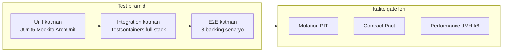
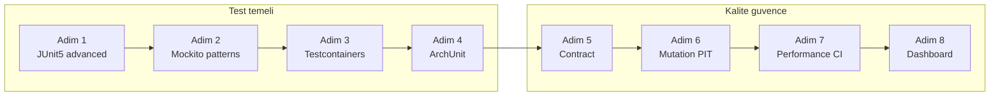
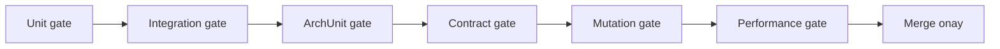
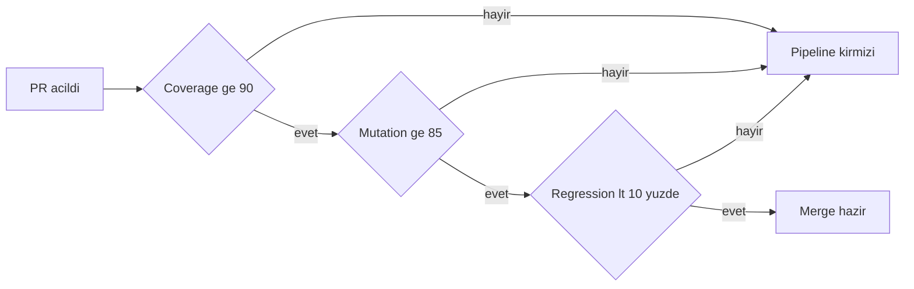

# Phase 12 Mini-Project — Banking Testing Excellence

```admonish info title="Bu projede"
- Phase 7-11'de yazdığın banking microservice'lerin üstüne eksiksiz bir test kalesi kuruyorsun: JUnit 5 + Mockito + Testcontainers + ArchUnit
- Servisler arası sözleşmeleri Spring Cloud Contract + Pact Broker ile kilitliyor, `can-i-deploy` gate'iyle güvenli deploy sağlıyorsun
- PIT mutation testing ile testlerinin gerçekten koruduğunu ispatlıyor, JMH + k6 ile performansı CI'da regresyona karşı savunuyorsun
- Tüm gate'leri tek bir `banking-quality-gate` pipeline'ında birleştiriyor, sonuçları Grafana dashboard'unda canlı izliyorsun
- 8 banking-özel kasten kırma senaryosuyla ledger, sanctions, fraud ve saga davranışlarını uçtan uca doğruluyorsun
```

## Hedef

Phase 7-11'de servisleri **inşa ettin**; Phase 12'nin 7 topic'inde ise onları test etmenin her aracını tek tek öğrendin. Bu projede hepsini `core-banking` ekosistemine tek serviste değil, **tüm servislerde** birleştiriyorsun. Bu mini-project Phase 12'nin **synthesis**'i — yeni teori yok, **quality bar kurmak** var; bir adımda takılırsan ilgili topic'e geri dön, oku, uygula.

Projenin sonunda test suite'in şu katmanlara sahip olacak — en geniş taban unit, en dar tepe uçtan uca banking senaryoları:



```admonish tip title="Süre ve önbilgi"
12-15 gün ayır (günde ~3 saat). Başlamadan önce: Phase 11 mini-project bitmiş, Phase 12'nin 7 topic'i (12.1-12.7) tamamlanmış, defter notların yazılmış ve mevcut servislerin `mvn test` yeşil olmalı. Buradaki işin çoğu **her servise aynı test disiplinini yaymak** + banking-özel senaryoları uçtan uca kurmak.
```

Bu bir TR banka denetim standardıdır: BDDK için test coverage + mutation kanıtlanabilir, KVKK/PCI-DSS için contract + ArchUnit privacy guard, production için integration + perf gate. Junior test yazar, mid iyi test yazar; sen bu projede **test stratejisini ve kalite gate'lerini tasarlıyorsun** — senior davranışı budur.

---

## Adım adım build plan

Sekiz adım var: ilk dördü test temelini kuruyor (unit → integration → mimari kural), son dördü kalite güvencesini bağlıyor (contract → mutation → performance → dashboard). Sonra 8 banking senaryosu ve her şeyi birleştiren CI pipeline geliyor.



### Adım 1 — JUnit 5 advanced setup (1 gün)

**Ne yapacaksın:** Her servise modern JUnit 5 iskeletini kuracaksın. **Neden:** Banking test'leri veri-yoğun ve çok senaryolu; parametric + dynamic test'ler olmadan her kombinasyonu elle yazmak sürdürülemez. **Nasıl:** Aşağıdaki yetenekleri her servise ekle:

- `@ParameterizedTest` matrix (IBAN, gün sayımı, fraud kuralları)
- `@TestFactory` dynamic (banka kodu başına, currency başına)
- `@Nested` organizasyon (3+ seviye)
- Custom assertion'lar: `TransferAssert`, `LedgerAssert`, `AuditAssert`
- Custom extension'lar: `LedgerInvariantExtension`, `MdcCleanupExtension`
- `@Tag` (unit / integration / slow / banking-domain) + Maven profile selective

**Kontrol noktası:** `mvn test -Punit` sadece unit-tag'li test'leri koşuyor; en az bir `@ParameterizedTest` IBAN matrisi ve bir `@TestFactory` currency fabrikası yeşil.

### Adım 2 — Mockito banking patterns (1 gün)

**Ne yapacaksın:** Her servisin unit test'lerini disiplinli Mockito pattern'lerine oturtacaksın. **Neden:** Gevşek stub'lar sessizce yanlış test yazdırır; banking'de yanlış geçen test, yanlış giden paradır. **Nasıl:** `@MockitoSettings(strictness = STRICT_STUBS)` ile başla — kullanılmayan stub derhal patlasın.

- `@InjectMocks` + `@Captor` banking pattern
- BDDMockito `given / willReturn / then / should`
- Servis başına 5+ banking senaryosu (sanctions, KKB, CB, saga, idempotency)
- `@Spy` partial mock `LedgerService`
- `InOrder` ile saga compensation sırası doğrulama
- `verifyNoInteractions` ile PCI sınırı koruma

```admonish warning title="STRICT_STUBS pazarlık konusu değil"
`LENIENT` ile geçen test yeşil görünür ama bir stub'ın hiç çağrılmadığını gizler — yani test ettiğini sandığın path aslında hiç çalışmıyordur. Banking test suite'inde tüm unit test'ler STRICT_STUBS altında koşar; kullanılmayan stub, test tasarımında hata demektir.
```

**Kontrol noktası:** Her serviste 5+ banking senaryosu STRICT_STUBS altında yeşil; saga compensation test'i `InOrder` ile ters sırayı kanıtlıyor.

### Adım 3 — Testcontainers integration tests (2 gün)

**Ne yapacaksın:** Gerçek altyapıya karşı koşan integration test tabanını kuracaksın. **Neden:** Mock'lu DB banking davranışını (transaction, lock, gerçek SQL) taklit edemez; production'a en yakın kanıt gerçek Postgres + Kafka + Keycloak'tır. **Nasıl:** Ortak bir `AbstractBankingIntegrationTest` taban sınıfı yaz; container'lar `static` + `@ServiceConnection` ile paylaşılan singleton olsun, her test öncesi state temizlensin.

En kritik iki parça: container'ların paylaşımlı tanımı ve her test sonrası ledger invariant kontrolü. <mark>Her integration test'ten sonra trial balance sıfır olmalı</mark> — aksi halde double-entry defteri bozulmuştur:

```java
@Container
@ServiceConnection
static PostgreSQLContainer<?> postgres = new PostgreSQLContainer<>("postgres:16-alpine")
    .withInitScript("db/banking-init.sql")
    .withReuse(true);

@AfterEach
void verifyLedgerInvariant() {
    BigDecimal diff = trialBalanceService.compute();
    assertThat(diff).isEqualByComparingTo(ZERO);
}
```

Container'lar tek sefer ayağa kalkar, her test `@Sql clean.sql` ile temiz state'ten başlar. Tam stack — Postgres + Kafka + Keycloak + Redis + LocalStack — ve dynamic property köprüleri tam listede:

<details>
<summary>Tam kod: AbstractBankingIntegrationTest (~50 satır)</summary>

```java
@SpringBootTest
@Testcontainers
abstract class AbstractBankingIntegrationTest {

    @Container
    @ServiceConnection
    static PostgreSQLContainer<?> postgres = new PostgreSQLContainer<>("postgres:16-alpine")
        .withInitScript("db/banking-init.sql")
        .withReuse(true);

    @Container
    @ServiceConnection
    static KafkaContainer kafka = new KafkaContainer(
        DockerImageName.parse("confluentinc/cp-kafka:7.5.1"));

    @Container
    static KeycloakContainer keycloak = new KeycloakContainer()
        .withRealmImportFile("/banking-realm.json")
        .withReuse(true);

    @Container
    static GenericContainer<?> redis = new GenericContainer<>("redis:7-alpine")
        .withExposedPorts(6379);

    @Container
    static LocalStackContainer localstack = new LocalStackContainer(
        DockerImageName.parse("localstack/localstack:3.0"))
        .withServices(KMS, S3);

    @DynamicPropertySource
    static void dynamicProps(DynamicPropertyRegistry r) {
        r.add("spring.security.oauth2.resourceserver.jwt.issuer-uri",
            () -> keycloak.getAuthServerUrl() + "/realms/banking");
        r.add("spring.data.redis.host", redis::getHost);
        r.add("spring.data.redis.port", () -> redis.getMappedPort(6379));
        r.add("aws.kms.endpoint", () -> localstack.getEndpointOverride(KMS).toString());
    }

    @BeforeEach
    @Sql(scripts = "/db/clean.sql")
    void cleanState() {}

    @AfterEach
    void verifyLedgerInvariant() {
        BigDecimal diff = trialBalanceService.compute();
        assertThat(diff).isEqualByComparingTo(ZERO);
    }
}
```

</details>

Her servise 25+ integration senaryosu yaz: repository (gerçek Postgres), REST controller, Kafka producer/consumer roundtrip, Keycloak token authorization, LocalStack KMS encrypt/decrypt ve stub üzerinden cross-service.

**Kontrol noktası:** Container'lar tek sefer ayağa kalkıyor (paylaşımlı singleton), servis başına 25+ integration test yeşil ve her birinden sonra trial balance sıfır.

### Adım 4 — ArchUnit rules — banking architecture (1 gün)

**Ne yapacaksın:** Mimari ve banking kurallarını compile-zamanı yerine test-zamanı ile zorlayacaksın. **Neden:** Bir kural insan review'una bırakılırsa er geç ihlal edilir; ArchUnit kuralı, PR'da otomatik kırmızı yakar. **Nasıl:** 50+ kuralı dört gruba böl.

**Hexagonal + Spring:** domain izolasyonu, application katmanı adapter bilmez, layered architecture, service'te `@Transactional`, controller'da repository yok.
**Naming:** Controller / Repository / Service / Port suffix zorunlu.
**Security:** field injection yok, `System.out.println` yok, catch-all exception yok, hardcoded secret yok.
**Banking domain:** para alanları BigDecimal, PII alanları `@Convert`, ledger erişimi sadece `LedgerService`, PAN sadece card modülünde, audit immutable, hassas endpoint'te `@PreAuthorize`, POST transfer'de `@IdempotencyKey`.

Bu grubun en pahalı kaçağı para tipidir — <mark>para hiçbir yerde double değil, her zaman BigDecimal</mark>:

```java
@ArchTest
static final ArchRule money_fields_use_bigdecimal =
    fields().that().haveNameMatching(".*(amount|balance|price).*")
        .should().haveRawType(BigDecimal.class)
        .because("float/double para hesabında yuvarlama hatası üretir");
```

**Kontrol noktası:** `mvn test -Dtest='*ArchitectureTest'` 50+ kuralı koşuyor; bir kuralı bilerek ihlal edince (örn. bir `double` para alanı) test kırmızı dönüyor.

### Adım 5 — Contract tests — Spring Cloud Contract (2 gün)

**Ne yapacaksın:** Servisler arası HTTP ve Kafka sözleşmelerini test ile kilitleyeceksin. **Neden:** Microservice dünyasında provider'ın sessiz bir değişikliği consumer'ı production'da kırar; contract test bu kırılmayı merge'den önce yakalar. **Nasıl:** Her servis çifti için 10+ contract yaz, Pact Broker'ı local ayağa kaldır ve deploy öncesi `can-i-deploy` gate'i koy.

- **Account ↔ Transfer:** debit (success + insufficient), credit, balance lookup, lock for transfer
- **Transfer ↔ Ledger:** journal post, reverse
- **Card ↔ Compliance:** authorization → fraud check
- **Transfer ↔ Notification:** transfer-events Kafka contract

Kafka event sözleşmeleri için Avro + Schema Registry kullan ve BACKWARD compatibility zorunlu tut — eski consumer, yeni event şemasını okuyabilmeli.

```admonish tip title="can-i-deploy güvenlik ağıdır"
Pact Broker sadece contract saklamaz; `pact-broker can-i-deploy --pacticipant transfer-service` komutu, o servisin karşılıklı doğrulanmış olduğu sürümlere göre deploy'un güvenli olup olmadığını söyler. Bu komut CI'da gate olunca, doğrulanmamış bir sürüm asla production'a gidemez.
```

**Kontrol noktası:** Servis çifti başına 10+ contract doğrulanıyor, Pact Broker local'de sözleşmeleri gösteriyor ve `can-i-deploy` gate'i pipeline'da koşuyor.

### Adım 6 — Mutation testing — PIT (1 gün)

**Ne yapacaksın:** Test'lerin gerçekten koruduğunu mutation testing ile kanıtlayacaksın. **Neden:** Yüksek coverage, kötü assertion'ları gizler — satır çalışır ama hata yakalanmaz; mutation testing kodu bilerek bozup test'in yakalayıp yakalamadığını ölçer. **Nasıl:** PIT'i STRONGER mutator'larla banking kritik sınıflara yönlendir, eşikleri yüksek tut ve PR'da sadece değişen kodu tara.

```xml
<plugin>
    <groupId>org.pitest</groupId>
    <artifactId>pitest-maven</artifactId>
    <configuration>
        <targetClasses>
            <param>com.bank.transfer.domain.*</param>
            <param>com.bank.ledger.domain.*</param>
            <param>com.bank.loan.domain.InterestCalculator</param>
            <param>com.bank.compliance.rule.*</param>
        </targetClasses>
        <mutators><mutator>STRONGER</mutator></mutators>
        <mutationThreshold>85</mutationThreshold>
        <coverageThreshold>90</coverageThreshold>
        <features>
            <feature>+GIT(from=origin/main)</feature>
        </features>
    </configuration>
</plugin>
```

`+GIT(from=origin/main)` feature'ı taramayı PR diff'iyle sınırlar — tüm codebase'i her PR'da mutasyona uğratmak dakikalarca sürer, PR-only ise saniyeler. Banking kritik sınıflar (Ledger, Interest, Fraud) ≥ %90 mutation skoru tutmalı; <mark>mutation skoru eşiğin altına düşen PR merge edilemez</mark>.

**Kontrol noktası:** `mvn pitest:mutationCoverage` kritik sınıflarda ≥ %85 mutation skoru raporluyor; bir assertion'ı bilerek zayıflatınca skor düşüp gate kırmızı dönüyor.

### Adım 7 — Performance CI (1.5 gün)

**Ne yapacaksın:** Performansı GitHub Actions'ta katmanlı gate'lerle savunacaksın. **Neden:** Performans regresyonu sessizce birikir; ölçüm CI'da olmazsa "yavaşladı" demek tahmindir. **Nasıl:** PR'da JMH mikro-benchmark + k6 smoke, gecelik k6 load, haftalık soak koştur ve baseline'a göre karşılaştır.

JMH benchmark hedefleri: money aritmetiği (BigDecimal), serialization (Jackson vs Avro), lock (synchronized vs Atomic), cache (Caffeine vs Redis), IBAN validation, encryption (AES-GCM), DB query (single vs batch). PR benchmark'ı main baseline ile karşılaştırılır ve <mark>bir benchmark %10'dan fazla gerilerse pipeline kırmızı</mark> olur, sonuç PR yorumuna yazılır.

```admonish warning title="Benchmark ancak stabil runner'da anlamlı"
Paylaşımlı `ubuntu-latest` runner'da CPU turbo ve komşu iş yükü, ölçümü %30 oynatır — regresyon zannettiğin şey gürültü olur. JMH regression job'ı `banking-benchmark-runner` gibi CPU pin'li, turbo kapalı dedicated runner'da koşmalı; yoksa gate güvenilmezdir.
```

<details>
<summary>Tam referans: performance-gate.yml (~43 satır)</summary>

```yaml
name: Banking Performance Gate

on:
  pull_request:
    branches: [main]
  schedule:
    - cron: '0 2 * * *'   # Nightly

jobs:
  jmh-regression:
    if: github.event_name == 'pull_request'
    runs-on: banking-benchmark-runner
    steps:
      - name: PR benchmark
      - name: Baseline benchmark
      - name: Compare + comment + gate (10%)

  smoke:
    if: github.event_name == 'pull_request'
    runs-on: ubuntu-latest
    steps:
      - name: Deploy PR preview
      - name: k6 smoke test

  nightly-load:
    if: github.event_name == 'schedule'
    runs-on: banking-perf-runner
    steps:
      - name: Deploy staging fresh
      - name: Seed data
      - name: k6 load (30 min, 1000 RPS)
      - name: Compare baseline
      - name: Slack on regression

  weekly-soak:
    if: github.event_name == 'schedule' && contains(github.event.schedule, 'sunday')
    timeout-minutes: 480
    steps:
      - name: k6 soak (4 hours)
      - name: Memory grow check
      - name: JFR heap dump compare
```

</details>

**Kontrol noktası:** PR'da JMH regression + k6 smoke koşuyor, %10 gate aktif ve sonuç PR'a yorumlanıyor; gecelik load ve haftalık soak schedule'da tanımlı.

### Adım 8 — Banking quality dashboard (1 gün)

**Ne yapacaksın:** Tüm kalite metriğini tek Grafana dashboard'unda toplayacaksın. **Neden:** Coverage, mutation, contract ve benchmark ayrı raporlarda kalırsa kimse bakmaz; tek panel, kalite trendini görünür ve tartışılır kılar. **Nasıl:** Her gate metriğini Prometheus'a yaz, dashboard'da panelle.

Paneller: servis başına test sayısı, coverage % (JaCoCo), mutation skoru % (PIT), başarısız contract doğrulamaları, ArchUnit ihlalleri, benchmark trend'i (son 30 gün), load p99 / error rate, soak memory-grow trend'i. Örnek PromQL sorguları:

```promql
# Mutation score per service
banking_mutation_score{service=~".*"}

# Coverage trend (7 günlük fark)
banking_coverage_percent{service=~".*"} - banking_coverage_percent{service=~".*"} offset 7d

# Contract verification success ratio
sum(banking_contract_verifications_total{status="success"}) / sum(banking_contract_verifications_total)
```

**Kontrol noktası:** Dashboard 8 panelde canlı veri gösteriyor; dashboard JSON'u repo'da (`docs/quality-dashboard.json`).

---

## Banking-özel test senaryoları (2 gün)

Bu 8 senaryo, banking davranışını uçtan uca — birden çok servis, gerçek altyapı — doğrular. Her biri bir üretim korkusunu kontrollü ortamda kanıtlar; sadece "geçti" değil, **doğru sebeple geçti** aramalısın.

1. **Ledger invariant under load** — 1000 concurrent transfer sonrası trial balance == 0, orphan journal entry yok, tüm ledger entry'leri dengeli.
2. **Idempotency duplicate** — aynı idempotency key 3x paralel → 1 transfer, 1 journal, 1 event.
3. **Sanctions screening real-time** — yaptırımlı karşı taraf → transfer reddedilir, audit loglanır, ledger'a hiç posting yok, event yayınlanmaz.
4. **Fraud detection smurfing** — 1 saatte eşiğin hemen altında 5 işlem → MASAK alert, compliance officer bildirimi, STR taslağı.
5. **Saga compensation** — 3 adımlı cross-bank transfer, 3. adım fail → ters sırada compensation, final ledger tutarlı.
6. **KVKK right to be forgotten** — müşteri silme talebi → crypto-shred doğrulanır, audit trail pseudonymize korunur, sonraki decrypt fail eder.
7. **Encryption tampering** — rest'te bozulmuş ciphertext → AEAD `AuthenticationFailure`, orijinal veri sızmaz.
8. **Refresh token rotation reuse** — kullanılmış refresh yeniden kullanılır → tüm token'lar revoke, security alert, kullanıcı bildirimi.

**Kontrol noktası:** 8 senaryonun tamamı integration test olarak `mvn verify` içinde yeşil; her biri hem pozitif sonucu hem de yan-etki yokluğunu (ör. ledger posting olmadığını) assert ediyor.

---

## CI integration — end-to-end (0.5 gün)

**Ne yapacaksın:** Tüm gate'leri tek `banking-quality-gate` pipeline'ında sıralayacaksın. **Neden:** Gate'ler ayrı ayrı çalışsa bile merge kararı tek yerde birleşmeli; dağınık pipeline'da bir gate atlanır. **Nasıl:** Unit → integration → archunit → contract → mutation → benchmark → smoke job'larını tanımla, hepsini `quality-gate-merged`'e bağla.



Karar mantığı basit ama katı: coverage, mutation ve regression eşiklerinden biri bile tutmazsa merge bloklanır.



<details>
<summary>Tam referans: banking-quality-gate.yml (~48 satır)</summary>

```yaml
# .github/workflows/banking-quality-gate.yml
name: Banking Quality Gate

on:
  pull_request:
    branches: [main, develop]

jobs:
  unit:
    runs-on: ubuntu-latest
    steps:
      - run: mvn -B test

  integration:
    runs-on: ubuntu-latest
    services: [postgres, kafka]
    steps:
      - run: mvn -B verify -Pintegration

  archunit:
    runs-on: ubuntu-latest
    steps:
      - run: mvn -B test -Dtest='*ArchitectureTest'

  contract:
    runs-on: ubuntu-latest
    steps:
      - run: mvn -B test -Dtest='*ContractTest'
      - run: pact-broker can-i-deploy --pacticipant transfer-service

  mutation:
    runs-on: ubuntu-latest
    steps:
      - run: mvn -B pitest:mutationCoverage -DwithHistory

  benchmark:
    runs-on: banking-benchmark-runner
    steps:
      - name: PR vs main JMH
      - name: 10% regression gate

  smoke:
    runs-on: ubuntu-latest
    needs: [unit, integration]
    steps:
      - name: k6 smoke

  quality-gate-merged:
    needs: [unit, integration, archunit, contract, mutation, benchmark, smoke]
    runs-on: ubuntu-latest
    steps:
      - name: All gates passed
        run: echo "PR ready to merge"
```

</details>

**Kontrol noktası:** Bir PR açtığında 7 gate paralel/sıralı koşuyor; biri kırmızı olunca `quality-gate-merged` çalışmıyor, hepsi yeşil olunca "ready to merge" mesajı düşüyor.

---

## Defter notları (20 madde)

Her maddeyi kendi cümlelerinle tamamla; bu notlar mülakatta senin ağzından çıkacak cümlelerin provasıdır.

<details>
<summary>Tam liste: 20 defter notu</summary>

1. "JUnit 5 advanced (parametric + dynamic + @Nested + custom assertions) banking matrix: ____."
2. "Mockito STRICT_STUBS + @Captor + BDDMockito + @Spy banking scenarios: ____."
3. "Testcontainers shared singleton + @ServiceConnection + per-test clean: ____."
4. "LedgerInvariantExtension @AfterEach trial balance check banking: ____."
5. "ArchUnit hexagonal + naming + banking-domain (money, PII, ledger access): ____."
6. "Spring Cloud Contract provider + stub + consumer banking pattern: ____."
7. "Pact Broker + can-i-deploy CI gate banking deploy safety: ____."
8. "Kafka event contract + Avro Schema Registry BACKWARD compat: ____."
9. "PIT STRONGER mutators + BIG_DECIMAL banking critical (Ledger/Interest/Fraud): ____."
10. "Banking mutation %90+ critical class + git diff PR-only: ____."
11. "JMH benchmark CI + PR vs main + 10% regression gate + PR comment: ____."
12. "k6 SLO-driven thresholds + banking realistic load model: ____."
13. "Nightly load + soak weekly + pre-release full suite banking: ____."
14. "Banking integration 25+ scenario per service (ledger + sanctions + fraud + saga): ____."
15. "8 banking-specific kasten kırma senaryo end-to-end test: ____."
16. "Banking quality dashboard Grafana (coverage + mutation + contract + benchmark): ____."
17. "Dedicated CI runner banking benchmark stable env (CPU pin + turbo off): ____."
18. "Test pyramid banking (unit ~70% + integration ~25% + e2e ~5%): ____."
19. "Banking test domain language (TransferAssert, LedgerAssert, AuditAssert): ____."
20. "Senior banking engineer mindset: behavior testing + property + mutation + contract: ____."

</details>

---

## Pratik desteği

Projeyi bitirdim dediğin an, aşağıdaki prompt'la Claude'a kapsamlı bir audit yaptır — kör noktalarını böyle yakalarsın.

<details>
<summary>Claude-verify prompt (mini-project bütünü için)</summary>

```
Phase 12 banking testing excellence mini-project'imi banking-grade kriterlere göre
değerlendir. PASS / FAIL / EKSIK işaretle, KOD YAZMA, sadece neyin eksik veya yanlış
olduğunu söyle:

1. JUnit 5 advanced:
   - @ParameterizedTest matrix (IBAN, day count, fraud) her serviste var mı?
   - @TestFactory dynamic (bank code, currency) kullanılıyor mu?
   - @Nested 3+ seviye organizasyon var mı?
   - Custom assertion (TransferAssert, LedgerAssert, AuditAssert) yazıldı mı?
   - LedgerInvariantExtension @AfterEach trial balance kontrol ediyor mu?
   - @Tag + Maven profile selective çalışıyor mu?

2. Mockito:
   - @MockitoSettings STRICT_STUBS aktif mi?
   - @InjectMocks + @Captor banking pattern var mı?
   - BDDMockito given/willReturn/then/should kullanılıyor mu?
   - Servis başına 5+ banking senaryo (sanctions, KKB, CB, saga, idempotency)?
   - InOrder ile saga compensation sırası doğrulanıyor mu?
   - verifyNoInteractions PCI sınırı test ediliyor mu?

3. Testcontainers:
   - Shared singleton + @ServiceConnection kullanılıyor mu?
   - Full stack (PG + Kafka + Keycloak + Redis + LocalStack) ayakta mı?
   - Her test öncesi clean, sonrası ledger invariant kontrolü var mı?
   - Servis başına 25+ integration senaryo var mı?
   - Test'ler mock DB değil gerçek container ile mi?

4. ArchUnit:
   - 50+ kural var mı (hexagonal + naming + security + banking-domain)?
   - Money fields BigDecimal, no double kuralı var mı?
   - PII @Convert, ledger access only LedgerService, PAN card-only?
   - Audit immutable, @PreAuthorize, @IdempotencyKey kuralları?
   - No field injection, no System.out, no catch-all, no hardcoded secret?

5. Contract:
   - Servis çifti başına 10+ contract var mı?
   - Account↔Transfer, Transfer↔Ledger, Card↔Compliance, Transfer↔Notification?
   - Pact Broker local + can-i-deploy gate CI'da mı?
   - Kafka event Avro Schema Registry BACKWARD compat mı?

6. Mutation (PIT):
   - STRONGER mutators + banking critical classes hedefli mi?
   - Kritik sınıf mutation ≥ %85-90 mı?
   - coverageThreshold + mutationThreshold gate mi?
   - +GIT(from=origin/main) ile PR-only tarama mı?

7. Performance:
   - JMH benchmark (money, serialization, lock, cache, IBAN, encryption, DB)?
   - PR vs main + %10 regression gate + PR comment var mı?
   - k6 smoke (PR) + nightly load + weekly soak tanımlı mı?
   - Benchmark dedicated stable runner'da mı (CPU pin, turbo off)?

8. Dashboard:
   - Grafana 8 panel (test count, coverage, mutation, contract, archunit, benchmark,
     load p99, soak memory) var mı?
   - Metrikler Prometheus'a yazılıyor mu?
   - Dashboard JSON repo'da mı?

9. Banking senaryolar:
   - 8 senaryo (ledger invariant, idempotency, sanctions, fraud, saga, KVKK,
     encryption tampering, token reuse) uçtan uca test mi?
   - Her senaryo yan-etki yokluğunu da assert ediyor mu (ledger posting yok vb.)?

10. CI end-to-end:
    - banking-quality-gate.yml 7 gate + quality-gate-merged var mı?
    - Bir gate kırmızıysa merge bloklanıyor mu?
    - 20 defter notu tamamlandı mı?

Her madde için PASS / FAIL / EKSIK ve kısa kanıt (dosya path, test ismi, workflow job).
Kod yazma.
```

</details>

---

## Tamamlama kriterleri (kendine sor)

- [ ] JUnit 5 advanced features (parametric + dynamic + @Nested + custom assertion/extension) her serviste
- [ ] Mockito STRICT_STUBS + @Captor + BDDMockito + @Spy + InOrder, servis başına 5+ banking senaryo
- [ ] Testcontainers full stack (PG + Kafka + Keycloak + Redis + LocalStack), servis başına 25+ integration test
- [ ] LedgerInvariantExtension her integration test sonrası trial balance == 0
- [ ] ArchUnit 50+ kural (hexagonal + naming + security + banking-domain) yeşil
- [ ] Contract tests (Spring Cloud Contract + Pact Broker + can-i-deploy) + Avro Schema Registry BACKWARD
- [ ] PIT mutation testing kritik sınıflarda ≥ %85, PR-only git scope
- [ ] JMH PR regression gate (%10) + k6 SLO-driven smoke/load/soak
- [ ] Banking quality dashboard 8 panelde canlı veri
- [ ] 8 banking-özel senaryo uçtan uca yeşil, yan-etki yokluğu assert ediliyor
- [ ] banking-quality-gate.yml 7 gate + merged job, bir gate kırmızıysa merge bloklu
- [ ] 20 defter notu tam
- [ ] Cevabı **rahatça** verebileceğim sorular: "Mutation testing coverage'dan ne farklı?", "can-i-deploy neyi garanti eder?", "Benchmark'ı neden dedicated runner'da koştun?", "Ledger invariant'ı nasıl test ediyorsun?"

Hepsi onaylı → Faz 12 PHASE_TEST'e geç → [PHASE_TEST.md](../PHASE_TEST.md)

---

## 12 faz tamamlandı — complete TR banking backend engineer

Bu, kitabın **son** mini-project'i. Bunu bitirince Phase 1-12'nin tamamını uçtan uca inşa etmiş oluyorsun:

```
Phase 1: Foundation ✓        Phase 7: Microservices ✓
Phase 2: Hexagonal + DDD ✓   Phase 8: Security ✓
Phase 3: JPA + Postgres ✓    Phase 9: Observability ✓
Phase 4: SQL + Oracle ✓      Phase 10: Banking Domain ✓
Phase 5: Spring Batch ✓      Phase 11: DevOps ✓
Phase 6: Kafka + Messaging ✓ Phase 12: Testing ✓
```

Phase 12 seni **junior test yazarı**ndan **test stratejisi tasarlayan senior**a taşır: test design + quality gate + team convention. TR banka mülakatında artık şu cümleleri rahat kurarsın: "Mutation testing ile testlerimin gerçekten koruduğunu ispatladım", "can-i-deploy gate'iyle doğrulanmamış sürümün production'a gitmesini engelledim", "ledger invariant'ı her integration test sonrası trial balance ile garanti ettim".

Sırada:
- Mock interview pratiği
- Real banking case study writeup
- Open-source contribution (Spring / banking lib)
- Conference talk submission (BDDK / Yazılım Tarafı / Devnot)

```admonish success title="Proje Tamamlama Kriterleri"
- Test piramidi kuruldu: her serviste JUnit 5 advanced unit + Testcontainers full-stack 25+ integration + ArchUnit 50+ kural yeşil
- Mockito STRICT_STUBS altında servis başına 5+ banking senaryo, saga compensation InOrder ile doğrulanıyor
- Contract test (Spring Cloud Contract + Pact Broker + can-i-deploy) ve Avro Schema Registry BACKWARD compat aktif
- PIT mutation kritik sınıflarda ≥ %85 (PR-only), JMH %10 regression gate + k6 smoke/load/soak koşuyor
- 8 banking-özel senaryo (ledger invariant, idempotency, sanctions, fraud, saga, KVKK, encryption tampering, token reuse) uçtan uca yeşil
- banking-quality-gate.yml 7 gate'i tek pipeline'da birleştiriyor; bir gate kırmızıysa merge bloklu, dashboard 8 panelde canlı
```
