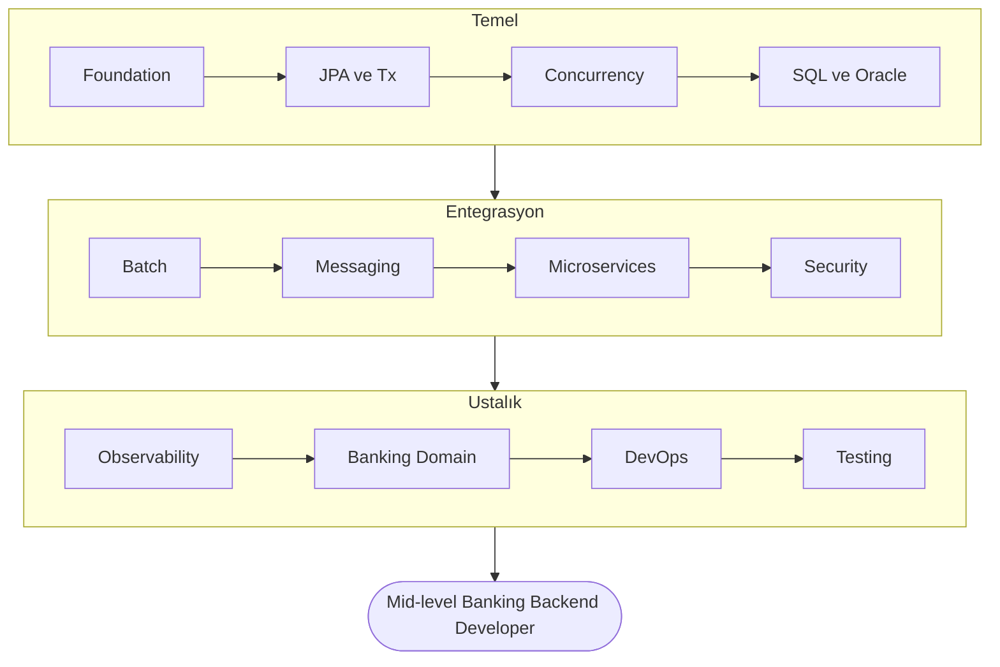

# Banking Backend Learning Path

TR major bank backend rolüne **junior → mid** seviyede çıkmak için 12 fazlık öğrenme programı.

## Yolculuğun haritası



## Bu klasör ne, nasıl kullanılır

Her faz bağımsız bir klasör. Her fazın içinde sıralı topic'ler var.

Bir topic'in iç yapısı (`README.md` içinde 4 bölüm):

1. **Kavramlar** — Okuyacağın detaylı dokümantasyon, kod örnekleriyle
2. **Mini task'ler** — Yapacağın küçük pratikler (10-30 dk her biri)
3. **Test yazma rehberi** — Bu topic için hangi testleri nasıl yazacaksın
4. **Claude-verify prompt** — Çalışmanı Claude'a verify ettirmek için kopyalayıp yapıştıracağın talimat

Her fazın sonunda:
- `mini-project/` — Tüm topic'leri birleştiren küçük proje
- `PHASE_TEST.md` — Faz biter, sonraki faza geçmeden kendini test edeceğin checklist

## Tek bir devasa proje: `core-banking`

Tüm bu öğrenmeyi tek bir GitHub repo'sunda biriktireceksin: `core-banking/`. Her faz mevcut kodun üstüne katman ekler.

Lokasyon önerisi: `~/projects/core-banking/`

## 12 Faz

| Faz | İsim | Süre | Anahtar Çıktı |
|---|---|---|---|
| 01 | [Foundation](./01-foundation/index.md) | 2 hf | Hexagonal arch, BigDecimal money, validation, error handling, ilk REST API |
| 02 | [JPA & Transactions](./02-jpa-transactions/index.md) | 3 hf | Propagation, isolation, locking, N+1, HikariCP tuning |
| 03 | [Concurrency & JVM](./03-concurrency/index.md) | 6 hf | Lock'lar, atomics, executors, virtual threads, GC, profiling |
| 04 | [SQL & Oracle](./04-sql-oracle/index.md) | 3 hf | Index, execution plan, PL/SQL, window functions |
| 05 | [Spring Batch](./05-batch/index.md) | 2 hf | EOD jobs, restart, partitioning, scheduling |
| 06 | [Messaging & Events](./06-messaging/index.md) | 4 hf | Kafka, outbox, saga, idempotent consumer |
| 07 | [Microservices](./07-microservices/index.md) | 4 hf | Service split, gateway, circuit breaker, tracing |
| 08 | [Security](./08-security/index.md) | 3 hf | Spring Security, OAuth2/Keycloak, JWT, encryption |
| 09 | [Observability & Performance](./09-observability/index.md) | 3 hf | Logs, metrics, traces, JMH, profiling |
| 10 | [Domain Mastery](./10-domain/index.md) | 4 hf | Double-entry, ISO 8583, ISO 20022, FX, regülasyon |
| 11 | [DevOps](./11-devops/index.md) | 2 hf | Docker, K8s basics, CI/CD |
| 12 | [Testing Mastery](./12-testing/index.md) | 2 hf | TestContainers, ArchUnit, contract testing, mutation |

**Toplam: ~38 hafta** günde 2-3 saat ciddi çalışma. 6 aya sıkıştırmak istersen testing'i paralel götür.

## Genel kurallar

1. **Atlamadan ilerle.** Sıralı tasarlandı, faz 3 bilmeden faz 6 olmaz.
2. **Her topic'in sonundaki testleri yaz.** Test yazma alışkanlığı, bilgi kadar değerli.
3. **Mini task'leri es geçme.** Okuduğun ile yazdığın arasındaki uçurum bilgini ortaya çıkarır.
4. **Hata = ilerleme.** Stack trace'i çözmeden geçme. Hata mesajını gör → hipotez kur → test et → öğren.
5. **Notion/Obsidian'da defter tut.** Her kavram için 3-5 satır **kendi cümlenle** özet.
6. **Claude'u sadece verify için kullan.** Kod yazdırma. Topic'in sonundaki claude-verify prompt'unu kopyala, kodunu göster, geri bildirim al.
7. **Her topic sonunda commit at.** `core-banking` repo'sunda anlamlı commit mesajları.

## Hızlı başlangıç

```bash
mkdir -p ~/projects/core-banking
cd ~/projects/core-banking
git init
```

Sonra → [Faz 1: Foundation](./01-foundation/index.md)

---

## Bu klasörü kim okur ne yapar (kullanıcı yolu)

```
1. banking-learning/01-foundation/README.md          ← faz overview oku
2. banking-learning/01-foundation/01-architecture/   ← topic 1'e gir
3. README.md'yi tamamen oku (kavramlar)              ← 1-2 saat
4. Mini task'leri yap (~/projects/core-banking'de)   ← 1-2 saat
5. Testleri yaz                                       ← 30 dk
6. Claude'a verify ettir (claude-verify prompt'u)    ← 15 dk
7. Commit at                                          ← 2 dk
8. Topic 2'ye geç (02-project-setup/)
9. ... her topic için tekrarla
10. Faz sonunda mini-project'i yap                   ← 1-2 gün
11. PHASE_TEST.md ile kendini sına
12. Sonraki faza geç
```
